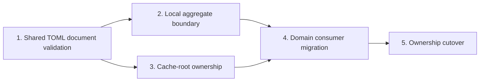

# Implementation Binding Contract

Every checkbox is required. A phase is complete only when all applicable RED → GREEN work and all BASELINE, AUDIT, REGRESSION, INTROSPECT, and VALIDATE tasks pass and every deliverable exists. RED tests SHALL fail for the intended missing behavior before GREEN begins. Existing behavior used as a compatibility oracle SHALL be recorded as baseline coverage, not represented as failing RED. GREEN SHALL satisfy only that phase's RED contract. An AUDIT MAY conclude that no implementation gap exists; it SHALL record that result and SHALL NOT manufacture a failing RED test. A CONDITIONAL GREEN task is satisfied when every gap found by its prerequisite audit is corrected, or when the audit records that no gap exists and no production change is required. INTROSPECT SHALL review the phase diff against its boundaries and invariants. VALIDATE SHALL run and record the stated checks. Contradictory discoveries SHALL return to planning artifacts before implementation continues.

A phase MAY depend only on lower-numbered phases named in its `Depends on` field. Later-phase evidence SHALL NOT satisfy an earlier dependency. Phase 1 proves the shared validation and release-gate boundary on representative integrated orchestration; Phase 4 migrates every command to that established boundary. Phase 1 completion SHALL NOT require Phase 4 command coverage.

## 1. Shared TOML Document Validation

**Depends on:** none

**Deliverables:** one configuration-document boundary used by both fixed project TOML files; closed reviewed/local document identity with resolved path; one `tomllib` parse per routed document; no partial result on parse failure; typed errors containing only document role/path, fixed classification, and applicable invalid field or numeric line/column; no raw parser message, source excerpt, token, value, or publishable original exception; caller-owned presentation and optional defense-in-depth redaction; standard-library duplicate detection without reimplementation or parser conformance duplication; a validation release-gate API proven on representative integrated build planning before effects; document-specific required/optional and schema behavior left to document owners. Migration of validate, display, update discovery, run, doctor, verification, and remaining orchestration is a Phase 4 deliverable.

- [x] 1.1 **RED:** Add a two-role routing test requiring both `docker-constructor.toml` and existing `docker-constructor.local.toml` to pass through one document boundary with their resolved path and closed role; verify both routing assertions fail before GREEN.
- [x] 1.2 **RED:** Add a parse-result test requiring one `tomllib` invocation and no parsed or partial result after `TOMLDecodeError`; verify the missing shared boundary fails.
- [x] 1.3 **RED:** Add one representative duplicate-definition integration case requiring `tomllib` rejection and no lossy mapping, without adding project-owned duplicate logic or exhaustive parser cases; verify the integration boundary is absent.
- [x] 1.4 **RED:** Add typed-error tests requiring document role/path and fixed classification, invalid fields only for field-attributable errors, numeric line/column only when available, and `malformed_toml` without fabricated detail otherwise; reject raw parser messages, source lines, tokens, values, excerpts, unrelated data, and a publishable original exception, and verify the projection contract fails before GREEN.
- [x] 1.5 **RED:** Add boundary-level and representative build-planning release-gate tests requiring no complete configuration result or probed external effect when either applicable document fails parsing or owner validation; verify the shared gate or its representative integration is absent. Do not require migration of every command in this phase.
- [x] 1.6 **GREEN:** Implement immutable reviewed/local document identity and shared `tomllib` parsing with no partial result; verify tasks 1.1–1.3 pass.
- [x] 1.7 **GREEN:** Implement shared typed error projection and the pre-effect release-gate API, and integrate it into representative build planning, while keeping raw parser data private and leaving schemas with document owners; verify tasks 1.4–1.5 pass. Defer complete command migration to Phase 4.
- [x] 1.8 **INTROSPECT:** Review the shared boundary and representative integration for duplicate parsing wrappers, project-owned TOML syntax logic, parser conformance suites, merged reviewed/local schemas, raw exception/message/source leakage, leaked values, missing document identity, fabricated field or syntax detail, caller-dependent primary sanitization, partial results, or effectful consumers before release; correct only Phase 1 boundary or representative-integration defects. Record unmigrated command routes for Phase 4 rather than treating them as Phase 1 defects.
- [x] 1.9 **VALIDATE:** Run focused two-role routing, parse invocation, representative duplicate, typed field-or-numeric-location selection, raw parser/source exclusion, caller presentation/defense-in-depth redaction, partial-result, boundary-level release-gate, and representative build-planning integration tests; record all Phase 1 deliverables, unchanged accepted TOML parsing, and the command routes deferred to Phase 4.

## 2. Local Aggregate Configuration Boundary

**Depends on:** Phase 1

**Deliverables:** fixed resolution of the optional selected-project `docker-constructor.local.toml`; one shared-boundary read/parse per command transaction; immutable aggregate local result; exactly `[host-access]`, `[cache]`, `[corporate-trust]`, and `[network.proxy]`; domain-owned table parsers; aggregate/domain validation before release; absence-compatible defaults; no `[output]` or other new table.

- [x] 2.1 **RED:** Add a resolution test requiring exactly `<selected-project>/docker-constructor.local.toml`, with no ancestor, workspace, installation-root, alternate-basename, or custom-option lookup; verify the aggregate owner is absent.
- [x] 2.2 **RED:** Add a transaction test requiring all local domain consumers to share one parsed local document; verify repeated or runtime-owned loading fails.
- [x] 2.3 **RED:** Add registry tests accepting exactly the four existing local tables and rejecting every unknown top-level table, including `[output]`; verify the closed aggregate registry is absent.
- [x] 2.4 **RED:** Add owner-schema tests requiring unknown/misplaced fields and domain-invalid values to retain document path plus field diagnostics from Phase 1; verify aggregate dispatch is absent.
- [x] 2.5 **RED:** Add absence tests requiring a missing optional companion to produce immutable domain defaults without creating the file; verify the aggregate result is absent.
- [x] 2.6 **GREEN:** Implement fixed optional companion resolution and route it through the Phase 1 document boundary; verify tasks 2.1–2.2 and 2.5 pass.
- [x] 2.7 **GREEN:** Implement the immutable aggregate result and explicit four-table domain registry; verify tasks 2.3–2.4 pass.
- [x] 2.8 **INTROSPECT:** Review for duplicate TOML parsing/error projection, domain field semantics in the aggregate owner, permissive registration, repeated reads, mutable results, partial domain validation, import cycles, or `[output]`; correct only local aggregate defects.
- [x] 2.9 **VALIDATE:** Run focused local resolution, shared parsing, table closure, owner dispatch, unknown/misplaced/domain-invalid input, absent companion, and immutable-default tests; record all Phase 2 deliverables.

## 3. Cache-Root Ownership

**Depends on:** Phase 1

**Deliverables:** confirm `user-cache-storage` as the existing sole authority for configured/default roots, configured-path syntax, lexical normalization, dangerous-root policy, no-follow root/descendant inspection, permissions, ownership, fallback, and named children; remove any remaining root-selection or child-derivation bypass; release cache-owned resolved or prepared state only after applicable safety checks and before effects; preserve aggregate parsing, diagnostics, timing, XDG/`~/.cache` fallback, layout, permissions, and no-companion-creation behavior; reproducibility retains only source separation, TTL, projection exclusion, and child mapping.

Existing cache behavior is the compatibility oracle and already resides primarily in `user-cache-storage`. Record passing baseline coverage for path rejection, dangerous roots, descendants, permissions, defaults, fallback, layout, and effect ordering. Audit consumers for concrete dependency, delegation, duplicated-policy, or release-order bypasses and do not manufacture RED failures for ownership or ordering that already exists. If an audit finds a gap, add a focused failing RED test before correcting it; otherwise record the no-gap result and preserve it with regression coverage. Sole-owner architecture enforcement belongs to Phase 5.

- [x] 3.1 **BASELINE:** Record the existing configured-root contract: empty/relative rejection, lexical normalization, the root/home/XDG/XDG-ancestor matrix, and failure before effects; identify `user-cache-storage` as the current behavioral owner.
- [x] 3.2 **BASELINE:** Record existing no-follow selected-root and encountered-descendant coverage for symlinks, wrong required types, foreign ownership, and unsecurability, including unchanged diagnostics and effect ordering.
- [x] 3.3 **BASELINE:** Record existing root/descendant permissions, no-parent-chmod behavior, configured/default selection, XDG/`~/.cache` fallback, named children, host-access independence, and no companion creation.
- [x] 3.4 **AUDIT:** Inventory cache consumers for independent root selection, fallback policy, canonical-child derivation, duplicated safety logic, or release-order bypasses outside `user-cache-storage`. Record every concrete bypass found, or explicitly record that none exists. Treat thin adapters that delegate to cache-owned APIs without adding policy as valid.
- [x] 3.5 **REGRESSION:** Add ownership coverage requiring reproducibility and cache consumers to obtain shared root and canonical-child decisions from cache-owned APIs, while allowing policy-free compatibility adapters and preserving reviewed/local source separation, TTL, and projection exclusion. If task 3.4 identifies a concrete bypass, first prove it with a focused failing test.
- [x] 3.6 **REGRESSION:** Map cache mutation, network access, artifact publication, container execution, and Docker execution to production entry points and effect probes proving applicable root and descendant validation completes first. Include positive controls showing the probes are reachable. If task 3.4 identifies a concrete release-order bypass, first prove it with a focused failing test.
- [x] 3.7 **CONDITIONAL GREEN:** Correct every concrete ownership or release-order bypass found by tasks 3.4–3.6 without changing accepted configuration, validation timing, diagnostics, paths, or effects. If no bypass is found, record that no production change is required and verify the ownership and release-order regression suites pass.
- [x] 3.8 **GREEN:** Keep aggregate `[cache]` validation limited to table shape and field type; treat `LocalConfig.cache.dir` as untrusted input until cache storage resolves it, and do not thread home, XDG, or filesystem state into aggregate parsing.
- [x] 3.9 **GREEN:** Keep reproducibility limited to reviewed/local source separation, reviewed TTL, projection exclusion, and consumer child-format mapping while delegating root selection and safety to cache storage; verify unchanged outputs.
- [x] 3.10 **INTROSPECT:** Review for independent root normalization, dangerous-root policy, XDG/home fallback, no-follow inspection, or canonical child definitions outside `user-cache-storage`; correct concrete Phase 3 consumer bypasses without moving filesystem-sensitive validation into the aggregate.
- [x] 3.11 **INTROSPECT:** Map every cache clause and pre-existing root-or-descendant protection to one owner and focused baseline or regression test; correct omissions, duplicate authority, diagnostics drift, permission/fallback drift, changed validation timing, or weakened no-follow/effect ordering.
- [x] 3.12 **VALIDATE:** Run configured-root, dangerous-root, no-follow root/descendant, unsafe-type, ownership, permission, fallback, layout, independence, projection, and ordering tests; distinguish pre-existing baseline behavior from newly corrected delegation gaps.
- [x] 3.13 **VALIDATE:** Record all Phase 3 mappings and confirm no companion creation, aggregate environment/filesystem dependency, or user-visible behavior change.

## 4. Domain Consumer Migration

**Depends on:** Phases 2 and 3

**Deliverables:** every command—including validate, display, update discovery, build, run, doctor, and verification—uses shared reviewed/local document validation, the Phase 1 release gate, and one local aggregate result; runtime host access consumes only `[host-access]` plus reviewed policy; cache and corporate-network consumers receive only domain state; existing mappings, environment, trust/proxy inputs, cache paths, and Docker vectors remain unchanged; companion and aggregate state remain absent from contexts, projections, and containers. This phase, not Phase 1, owns complete cross-command gate integration.

- [x] 4.1 **RED:** Require validate, display, update discovery, build, run, doctor, and verification to route applicable reviewed/local files through Phase 1 and share one Phase 2 local result; verify each unmigrated route fails.
- [x] 4.2 **RED:** Require runtime host access to consume only local `[host-access]` plus reviewed policy while preserving Docker-gateway, external-address, disabled-mode, `HOST_ACCESS_ADDRESS`, and `HOST_PROXY_PORT` vectors; verify ownership fails.
- [x] 4.3 **RED:** Require cache consumers to consume only Phase 3 state while preserving all cache and generated-state paths; verify ownership fails.
- [x] 4.4 **RED:** Require corporate-network consumers to consume only trust/proxy state, remain independent from host access, and preserve build/runtime/download/assembler inputs; verify ownership fails.
- [x] 4.5 **RED:** Require both source TOML documents, paths, and aggregate values to remain absent from serialization, projections, contexts, and containers while authorized derived values and the separate CA bundle remain permitted; verify confinement wiring fails.
- [x] 4.6 **GREEN:** Migrate all command orchestration to shared document validation and the local aggregate result; verify task 4.1 passes.
- [x] 4.7 **GREEN:** Migrate runtime host-access, cache, and corporate-network consumers to domain results; verify tasks 4.2–4.4 pass.
- [x] 4.8 **GREEN:** Enforce document/aggregate confinement while retaining authorized derived values and separate project inputs; verify task 4.5 passes.
- [x] 4.9 **INTROSPECT:** Review for bypassed shared parsing, reopened companion files, cross-domain access, vector/path drift, host-access coupling, configuration leakage, or blocking the separate CA bundle; correct only migration defects.
- [x] 4.10 **VALIDATE:** Run command-routing, reviewed/local diagnostics, host-access, cache, corporate-network, serialization, projection, context, and container tests; record unchanged behavior and complete Phase 4 migration.

## 5. Ownership Cutover

**Depends on:** Phase 4

**Deliverables:** no independent project TOML parsing/error projection remains; no aggregate local ownership remains in `runtime-host-access`; obsolete adapters are removed; all moved clauses have destination requirements/tests; repository and strict OpenSpec checks pass; the predecessor is ready for synchronization/archive before `improve-host-build-observability`.

- [ ] 5.1 **RED:** Add an architecture test rejecting project TOML parsing or parse-error projection outside `configuration-document-validation`; verify old paths fail.
- [ ] 5.2 **RED:** Add an architecture test rejecting companion parsing or aggregate construction outside `local-project-configuration`; verify old runtime ownership fails.
- [ ] 5.3 **RED:** Add dependency and sole-owner architecture tests rejecting aggregate-owner imports from domain modules, runtime ownership of cache/network state, and cache-root normalization, dangerous-root policy, XDG/home fallback selection, no-follow cache safety logic, or canonical cache-child definitions outside `user-cache-storage`; verify any remaining pre-cutover direction or duplicate authority fails.
- [ ] 5.4 **RED:** Add a contract-inventory test requiring every moved clause/scenario to map to a destination capability and passing regression; verify omissions fail.
- [ ] 5.5 **GREEN:** Remove independent parsing/error wrappers and route both documents exclusively through Phase 1; verify task 5.1 passes.
- [ ] 5.6 **GREEN:** Remove runtime aggregate ownership and obsolete companion-loading adapters; verify tasks 5.2–5.3 pass.
- [ ] 5.7 **GREEN:** Complete the clause-to-owner/test inventory using Phases 1–4 evidence; verify task 5.4 passes without weakening source clauses.
- [ ] 5.8 **INTROSPECT:** Review the complete diff for behavior changes, `[output]`, open registration, new CLI/environment sources, parser duplication, cache safety loss, configuration exposure, duplicate authority, stale adapters, or unrelated edits; correct all findings.
- [ ] 5.9 **VALIDATE:** Run complete configuration, cache, host-access, corporate-network, inventory, projection, Docker vector, doctor, confinement, and architecture suites; record success.
- [ ] 5.10 **VALIDATE:** Run repository typecheck, lint, unit, integration, and build checks; record commands and results.
- [ ] 5.11 **VALIDATE:** Run `openspec validate extract-local-project-configuration --strict` and `git diff --check`; record clean results and readiness for synchronization/archive before applying `improve-host-build-observability`.
