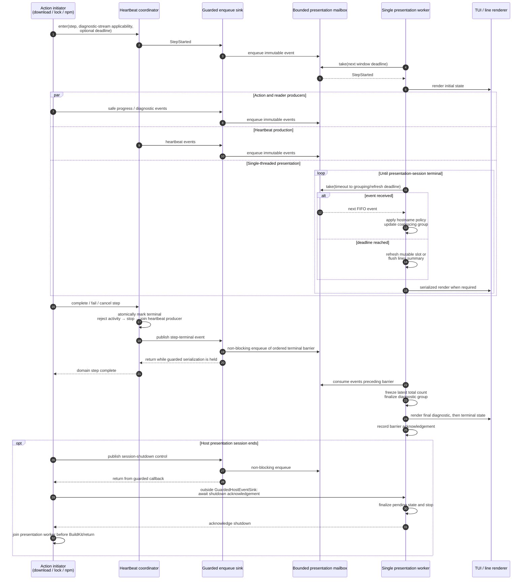
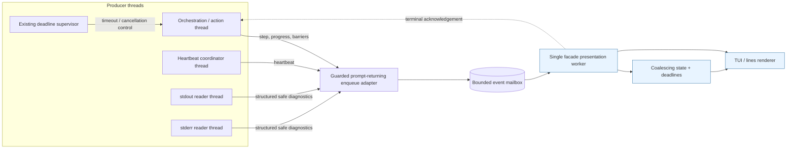

## Context

See `proposal.md` for motivation. The current immutable `HostPhaseEvent`/`HostDiagnosticEvent` boundary gives coarse liveness and streams redacted assembler chunks, while the facade decides whether an interactive text sink exists. One locked-assembly phase currently contains blocking coordination, cache lookup, Docker startup, npm execution, validation, and publication. Host artifact transports stream bytes but emit no progress, and their display-safe failures preserve only the outer exception type. Existing constraints require clean JSON, no direct domain printing, optional failure-isolated sinks, bounded retained diagnostics, secret redaction before presentation or persistence, fixed npm/deadline policy, and unchanged cleanup and locking semantics.

## Goals / Non-Goals

**Goals:**

- Add detailed, deterministic host activity without weakening the stable lifecycle event contract.
- Make last observed activity, silence, elapsed duration, and deadlines accurately observable across all host pipeline steps.
- Centralize safe network diagnostic presentation and contextual failure rendering.
- Keep heartbeat concurrency testable and harmless to execution.
- Define intentional noninteractive line output as an explicit specification change rather than an accidental consequence of renderer reuse.

**Non-Goals:**

- Parse npm output into authoritative package-level progress or classify every npm failure as network-related.
- Inspect Docker CPU, network counters, sockets, or container filesystems.
- Add percentages, rates, or totals when the executing boundary cannot observe them cheaply.
- Change the 30-minute assembly deadline, blocking lock behavior, or cleanup ownership; npm policy identity changes only as the deliberate consequence of the accepted pinned-version logging decision.
- Adapt or apply `reconstructed-from-photos.patch`; only its safe logical-asset and nested-type ideas are carried forward.

## Decisions

### Keep lifecycle stable and add a perpendicular operational event union

Do not add states or detail fields to `HostPhaseEvent`. Extend the internal host event union with immutable operational facts: step transition, transport byte progress, heartbeat, and selected diagnostic. Each step-start fact declares through a closed field whether that operation has an expected diagnostic stream; this is true for `npm ci` and false for host downloads. Heartbeat facts carry an optional closed last-activity kind (`diagnostic` or `transport_progress`) and its whole monotonic age in seconds, which MUST be at least one; they never carry a wall-clock timestamp. Before either kind has been observed, or while its age is less than one second, both fields are absent and presentation reports only step elapsed and any separately applicable diagnostic silence. Steps use a closed enum spanning artifact acquisition, lock wait, cache lookup/reuse, stale-stage cleanup, container startup, npm execution, validation, publication, and Docker transition. Events contain no terminal escapes and no exception objects.

This preserves existing lifecycle consumers and lets the facade evolve presentation separately. A free-form message-only event was rejected because it would make ordering, redaction, and timing assertions fragile. Encoding every step as a new host phase was rejected because steps do not share the phase lifecycle and would break the stable phase contract.

### Use an orchestration-owned activity monitor

A reusable activity monitor wraps potentially long host operations. It receives an injected monotonic clock and waiter, observes step entry/exit, diagnostic activity, and transport progress, and emits its first heartbeat 3 seconds after operation start followed by heartbeats at intervals no greater than 1 second, independent of intervening activity. It tracks diagnostic silence separately only for a step that declared an expected diagnostic stream: only stdout/stderr resets that clock, transport progress does not, and the heartbeat exposes diagnostic silence exactly when it reaches 2 minutes and thereafter. Steps without an expected diagnostic stream carry no diagnostic-silence value. It also records the kind and monotonic observation time of the latest diagnostic or transport-progress activity, rounds their age down to whole seconds, and projects it into each heartbeat only when the result is at least one second; before the first observation or during its first second it emits no last-activity value. Neither activity nor last-activity reporting delays or suppresses the fixed heartbeat cadence. It includes remaining time only when the wrapped operation has an existing fixed deadline. It never represents diagnostic silence as inferred process or network inactivity.

The monitor owns its bounded heartbeat timer/thread lifecycle and joins that heartbeat producer before the step returns or raises. `GuardedHostEventSink` serialization protects only prompt producer callback invocation and bounded non-blocking mailbox enqueue; no callback renders, waits for presentation acknowledgement, flushes, or joins any presentation worker/timer while the guarded serialization lock is held. Monitor/enqueue/renderer failure remains secondary. For blocking lock acquisition, the monitor observes around the unchanged blocking call; it neither polls nor times out the lock. For npm, the streaming collector marks activity for every received stdout/stderr chunk. For host downloads, each yielded body chunk can update bytes and activity without another probe.



The initiator reports execution facts but owns neither heartbeat timing nor terminal presentation. The heartbeat coordinator tracks an activity-independent heartbeat schedule, an applicability-gated diagnostic-silence clock reset only by stdout/stderr, and the latest observed diagnostic-or-transport activity kind/time; it emits only monotonic durations, never an absolute timestamp, and neither renders output nor interprets silence as process or network inactivity. Producer threads call a prompt-returning `GuardedHostEventSink` adapter; while guarded serialization is held, the adapter performs only failure-isolated bounded non-blocking enqueue of an immutable event and returns. It never renders, waits for a barrier, flushes, or stops/joins presentation machinery. Exactly one facade presentation worker drains that mailbox and exclusively owns hostname selection, coalescing state, mutable TUI state, window deadlines, and renderer calls, so those mutable concerns require no cross-thread locking. The renderer performs only worker-directed region updates and durable writes. On completion/failure the heartbeat coordinator atomically marks the step terminal, rejects later activity, cancels and joins heartbeat production, and only then publishes the terminal event; therefore terminal presentation cannot be followed by a racing heartbeat. Before that publication, an executor that owns stdout/stderr readers drains and joins them so no diagnostic producer remains able to enqueue behind the terminal. The guarded adapter enqueues an ordered terminal barrier and returns immediately. The single presentation worker later consumes all preceding producer events in mailbox order, freezes and finalizes the latest repetition count, renders the terminal state, and records acknowledgement. No producer waits for that acknowledgement inside its sink callback. At the facade/native-output or facade/return boundary, the owning initiator performs shutdown acknowledgement waiting and worker join only after the guarded sink call has returned.



Only the presentation worker mutates coalescing and renderer state. The bounded mailbox has two independently capacity-limited logical lanes. The reliable control lane admits lifecycle events, step transitions, terminal/shutdown barriers, timeout, and cancellation; its reserved capacity is sized from the protocol's bounded maximum number of outstanding controls and cannot be consumed by diagnostics or replaceable telemetry. The best-effort telemetry lane admits diagnostics, heartbeats, byte progress, and other replaceable operational updates. Diagnostic overflow drops the incoming diagnostic; replaceable heartbeat or progress updates MAY supersede an older update for the same step and kind. Thus diagnostic floods cannot evict control events or consume their reservation.

`GuardedHostEventSink` assigns one monotonic sequence number to each admitted event while producer callbacks are serialized. The worker selects the lowest sequence number at the heads of the two lanes, establishing one consumption order across all admitted events. Causal terminal ordering additionally comes from joining heartbeat and stream-reader producers before admitting the terminal barrier, which is consequently processed after every earlier admitted event. A dropped diagnostic consumes no sequence position and cannot delay a terminal event.

Admission to both lanes is bounded and non-blocking. In particular, the reliable lane MUST NOT wait for capacity while `GuardedHostEventSink` serialization is held: blocking there could stall domain execution or deadlock shutdown. Tests derive the reservation bound, saturate the telemetry lane, and prove that the protocol's maximum outstanding control set remains admissible. Barrier acknowledgement is consumed only outside `GuardedHostEventSink` serialization; on ordinary renderer failure the disabled worker continues consuming and acknowledging admitted control until session shutdown.

Reliable-lane exhaustion is a protocol-invariant violation with a separate capacity-independent recovery path. If any reliable event, including a terminal or shutdown barrier, cannot be admitted, the adapter atomically marks the presentation session failed, sets an idempotent emergency-stop signal, wakes the mailbox condition, records that the attempted barrier has no acknowledgement to await, and returns the admission failure immediately. Signalling performs no rendering, acknowledgement wait, flush, stop wait, or join while `GuardedHostEventSink` serialization is held. The emergency signal occupies no mailbox slot and therefore remains available when either lane is full. On observing it, the worker disables rendering, discards pending coalescing state and queued events, publishes a distinct worker-stopped acknowledgement, and exits without waiting for or acknowledging the unadmitted barrier. After the guarded callback returns, the facade branches on admission failure: it skips the missing barrier acknowledgement, waits for worker-stopped acknowledgement, and joins the worker before continuing the primary BuildKit, success, failure, timeout, or cancellation path. Thus reliable exhaustion cannot turn an absent barrier into an indefinite wait or leave a presentation worker alive.

Renderer-owned timers were rejected because presentation lacks authoritative step/deadline state and complicates cleanup. Executor-only timers were rejected because they cannot cover acquisition, locks, validation, or publication.

### Separate activity observation from presentation policy

This change depends on `extract-local-project-configuration` being implemented, synchronized, and archived first. The predecessor owns fixed companion resolution, aggregate closed composition, reviewed/local isolation, cache-clause preservation, and host-only confinement. This change only registers the new `[output]` table through that boundary and keeps its field semantics in `docker-build-output`; it does not reopen host-access, cache, or corporate-network ownership.

Add local output settings with closed values:

```toml
[output]
host_heartbeat = "interactive" # interactive | lines | off
show_network_hosts = false
```

`interactive` is the default and creates replaceable progress only when text stderr is a TTY: it renders the first heartbeat at 3 seconds and refreshes at least once per second thereafter. `lines` creates newline-terminated live host events in text mode, including explicitly selected noninteractive execution: it renders the first heartbeat at 3 seconds, emits ordinary durable heartbeat lines exactly 30 seconds after the preceding durable status, emits the diagnostic-silence transition exactly at 120 seconds, and restarts the 30-second durable-line interval from that transition. `off` makes the facade ignore heartbeat events for presentation but does not alter coordinator heartbeat production, lifecycle terminal states, or actionable diagnostics where a live sink is otherwise authorized. JSON never creates a live sink. SDK/injected callers remain opt-in by passing a sink.

The noninteractive `lines` behavior intentionally modifies the current no-live-sink specification and receives explicit parser, facade, and acceptance coverage. Environment-variable aliases and new CLI flags are excluded; the existing verbose mode remains independent.

### Separate mutable diagnostic display from durable finalization

The single facade presentation worker directs one transient status line and one mutable diagnostic slot in interactive mode. The first diagnostic of any classification becomes visible immediately in the mutable slot; identical repeats update its total on the next at-most-one-second refresh without durable repeat lines, while an admitted conservative one-token numeric variant replaces the slot without a suffix and resets the exact-repeat count. When an identity/template mismatch, omission notice, step terminal, session shutdown, or BuildKit transition finalizes the slot, the worker performs `freeze latest count → clear transient region → write final durable diagnostic → clear slot → restore remaining status when applicable` under its exclusive renderer ownership. Terminal/session finalization does not restore obsolete status. Heartbeats update the transient status line in `interactive`, become durable lines in `lines`, and are ignored in `off`. No domain component emits control characters.

Making warnings/errors bypass the slot would make coalescing classification-dependent and permit floods. Treating mutable updates as durable writes would duplicate diagnostics. Buffering the first diagnostic until finalization would recreate current opacity. Letting stream readers print directly would bypass mailbox ordering and presentation policy.

### Treat stdout/stderr as the npm activity proxy

For `npm ci`, which declares an expected diagnostic stream, any assembler stdout/stderr chunk resets diagnostic-silence timing and becomes the latest `diagnostic` activity. Host downloads declare no diagnostic stream: each yielded body chunk updates cumulative bytes and becomes the latest `transport_progress` activity, while no diagnostic-silence clock or value exists for that step. Transport activity never resets an applicable diagnostic-silence clock, and neither activity kind resets the heartbeat schedule. Heartbeats expose the latest kind and whole monotonic age only from one second onward so the facade can render `last diagnostic 1s ago` or `last byte progress 4s ago`; sub-second ages are omitted rather than rendered. No heartbeat is delayed to reach the reporting threshold. No conclusion is drawn from absent output. In particular, neither silence nor human-readable npm HTTP text proves that npm is currently downloading; presentation may report only observed diagnostics and MUST NOT label npm as actively downloading. Safe npm warning, error, retry, timeout, and status lines are presented after sanitization. npm human-readable text never becomes a Constructor lifecycle/control event. The assembler emits classified structured safe diagnostics without coalescing, while the uncoalesced secret-redacted and URL-sanitized stream continues feeding the existing bounded tail. The facade presentation worker coalesces every sequence of diagnostics with identical final safe rendered text and matching presentation identity, regardless of warning/error/retry/status classification, and counts admitted occurrences including the first. In interactive mode only, the conservative numeric-variant rule replaces one mutable value without treating it as an exact repeat. Constructor lifecycle events are typed control events rather than diagnostic lines and are never coalesced. This explicitly relaxes the occurrence-count guarantee at mailbox saturation: because ordinary diagnostics are best-effort, a rendered `N` is exact only for occurrences admitted to the telemetry lane and MUST NOT be described as the total emitted by npm or observed by producers.

In `lines` mode, the worker uses fixed one-second monotonic windows: the first occurrence is rendered immediately, each identity-matching exact repeat increments the total, every changed numeric value remains a separate line, and a group with total greater than one emits `<diagnostic> (repeated N times)` at window end or immediately before a different diagnostic or terminal event. A different diagnostic first flushes the pending summary so observable order is preserved. A single-occurrence group emits no summary.

In interactive mode, the presentation worker owns one mutable diagnostic slot rendered by the TUI. The first admitted occurrence populates it without a suffix; identical admitted repeats increment the total and the next one-second TUI refresh replaces the slot with `<diagnostic> (repeated N times)`. The group remains mutable until a different diagnostic or terminal event finalizes it; continuous admitted repeats therefore update one line rather than creating durable output. Finalized single-occurrence diagnostics have no suffix. A later identical diagnostic starts a new group. The canonical suffix is exactly ` (repeated N times)`, with `N >= 2` denoting total admitted occurrences, not additional repeats.

The enqueue adapter records diagnostic drops in a fixed-width saturating omission counter, independent of diagnostic identity. The worker emits one ordered, non-coalesced omission notice before the next admitted diagnostic or terminal barrier and then resets the reported counter. At counter saturation the notice states a lower bound rather than an exact value. The notice does not reconstruct diagnostic identity or add dropped occurrences to a group's `N`; therefore no bounded producer-side per-diagnostic map is required and presentation never makes a false exact-multiplicity claim. Retained assembler tails remain independent of this presentation mailbox and keep their existing byte-bound and original admitted-to-the-collector ordering.

The implementation uses conservative line classification only for presentation priority, not domain failure classification. Unknown lines remain available to bounded diagnostics and may be presented when existing policy requires it; they are never treated as trusted merely because npm emitted them.

### Gate npm HTTP logging on a pinned-version research spike

Before fixing the live-line source, run the exact pinned npm 11.16.0 in the reviewed Node image with `loglevel=http` under controlled cache-hit, cache-miss, retry, and timeout cases. Capture whether observations arrive through the existing stdout/stderr pipes before process exit, whether they distinguish useful HTTP/cache outcomes, whether repetition can be bounded, and whether every emitted URL form passes the shared sanitizer. The spike must use fixtures or a controlled local endpoint rather than depending on public-registry timing, and it must record representative raw and projected output plus a binary accept/reject decision.

Accept `loglevel=http` only if all cases produce timely useful observations, sanitization tests cover every observed network token, and the resulting volume can be aggregated without suppressing warnings/errors. On acceptance, add the loglevel to the canonical reviewed npm policy and policy digest, update exact invocation/evidence expectations, and intentionally invalidate outputs assembled under the prior identity. On rejection, preserve the current command and identity and use existing stdout/stderr solely for diagnostic-silence reset, last diagnostic activity, and safe diagnostics. In neither branch may human-readable npm lines become authoritative failure classification or a claimed total download percentage.

Choosing `verbose` or `silly` without a gate was rejected because of unstable noise and increased disclosure surface. Parsing npm's TTY progress bar or relying on `--json` was rejected because neither is a stable live download-event interface.

### Distinguish hidden URL identity and numeric diagnostic updates

Sanitization deliberately removes URL paths and other disallowed components from rendered text, but diagnostics referring to different hidden resources must not become one exact-repeat or numeric-update group merely because both render as `<redacted>`. For each complete URL token, derive an opaque fixed-width fingerprint with a cryptographic keyed digest and a fresh random presentation-session key. Build the digest input from the scheme, normalized hostname, path, and the explicit port exactly when one was present, including an explicitly written default port. Remove userinfo, query, and fragment before fingerprinting; exclude proxy information. Preserve URL fingerprint order and multiplicity when a diagnostic contains more than one URL. The key and fingerprints are ephemeral: they MUST NOT enter rendered text, retained tails, failure reports, persisted evidence, policy identity, or cross-session correlation. Normalized hostnames remain separate structured facts solely for facade hostname-display policy and are not a separate coalescing-key component after final rendered text is formed.

Coalescing identity includes phase, step, stdout/stderr stream, closed diagnostic classification, logical resource, final safe rendered text or its numeric template, and the ordered URL-fingerprint tuple. Exact-repeat behavior remains unchanged. In interactive mode only, two consecutive diagnostics form one numeric-variant group when all identity metadata matches, the final rendered texts contain the same number of numeric tokens, all nonnumeric text and all but exactly one numeric token are byte-identical, and that one token changes. Numeric-token extraction SHALL examine the entire maximal numeric-looking sequence rather than accept a valid-looking substring. A valid token consists of one or more ASCII digits followed by zero or more `.` plus one-or-more-digit segments (for example `1`, `42`, `1.2`, or `10.20.30`). Neither adjacent boundary may be an ASCII letter, digit, underscore, dot, plus, or minus, so embedded identifiers such as `item1` and signed forms such as `-1`, `+1`, or `-1.2` are not tokens. A maximal sequence containing a leading or trailing dot, an empty dot-separated segment, or an adjacent sign is invalid in full; `.1`, `1.`, and `1..2` MUST NOT yield a valid substring token. The changed diagnostic replaces the mutable slot, resets its exact-repeat count to one, and carries no repetition suffix; an exact repeat of that latest value resumes canonical ` (repeated N times)` behavior. Numeric values need not be monotonic. At finalization only the latest interactive value is durably written. An omission notice or any identity/template mismatch finalizes the group.

`lines` mode never applies numeric-variant grouping: each changed numeric value remains a separate durable line so redirected and CI logs preserve observable progress. Its existing exact-repeat window remains unchanged. The bounded retained tail likewise preserves every sanitized occurrence without either form of presentation grouping. Every stdout/stderr chunk marks diagnostic activity before mailbox admission and presentation, so numeric grouping and telemetry drops cannot suppress diagnostic-silence reset or latest-activity observation.

A plain fast hash was rejected because stable hashes of predictable or secret-bearing URLs create an offline guessing oracle. A process-stable or persisted digest was rejected because it would permit cross-session correlation. Grouping solely by redacted rendered text was rejected because distinct hidden resources could collapse into one misleading diagnostic.

### Keep diagnostic coalescing in one facade worker

Use no separate coalescing timer thread. The single presentation worker computes the nearest `lines` window or interactive refresh deadline from an injected monotonic clock and blocks on the two-lane mailbox `take(timeout=remaining)`. Event arrival and deadline expiry are therefore serialized in one thread; each incoming identical admitted diagnostic increments the in-memory count, while an admitted interactive numeric variant replaces the latest mutable value and resets its exact-repeat count. Terminal writes occur only when mode rules require them. The count is intentionally not an occurrence count for diagnostics dropped before admission.

The worker lives for the complete host-presentation session across successful step terminals. An admitted step-terminal barrier freezes and durably finalizes the current diagnostic group before rendering the step terminal state, then records barrier acknowledgement; the producer callback has already returned and does not wait for it. The barrier does not stop the worker when another host step follows. Host-pipeline completion before BuildKit, host failure, timeout, and cancellation first attempt to enqueue a session-shutdown barrier through a prompt-returning guarded callback. After that callback returns, the facade either waits for the admitted barrier's ordered finalization/acknowledgement or, if reliable admission failed, skips that nonexistent acknowledgement and follows the emergency worker-stopped acknowledgement path; it joins the worker before native output or return in either branch. Renderer failure is caught in the worker, atomically disables further rendering, discards pending presentation state, and leaves the worker draining control barriers so producers cannot block; the primary operation is unchanged. Reliable-lane exhaustion instead wakes and terminates the worker through the capacity-independent emergency signal. No render occurs after session-shutdown or worker-stopped acknowledgement. JSON/absent-sink execution creates no presentation worker.

Keeping coalescing in assembler execution was rejected because window-end flush requires presentation lifecycle and policy ownership, would make Phase 8 depend on facade configuration, and could leak a timer beyond the domain operation. Flushing line mode only on the next event was rejected because a final repeated burst could remain invisible indefinitely. Printing every interactive repeat was rejected because it defeats coalescing at the terminal-write boundary; the mutable slot exposes the latest total on the existing one-second TUI refresh.

### Report host download bytes only at the existing streaming boundary

Whenever the existing acquisition boundary yields a body chunk, it MUST add that chunk length to cumulative received bytes and update latest `transport_progress`; the coordinator publishes the latest cumulative value at heartbeat cadence rather than emitting one presentation event per chunk. These host-download steps do not declare a diagnostic stream and therefore never emit diagnostic-silence duration. They do not issue HEAD requests, require `Content-Length`, buffer bodies, or calculate rates/percentages. Omission is permitted only for a compatible injected transport that cannot expose chunk observation without an additional operation, buffering, or semantic change. Logical start and terminal activity remain mandatory.

### Centralize safe network and exception-type projection

Introduce one boundary-safe diagnostic projection layer used by host artifact acquisition, Pi release acquisition, npm live lines, retained tails, and failure reports. It does not accept output policy. It produces a structured safe diagnostic containing phase/step/stream, sanitized text, optional safe logical resource, closed classification, and a tuple of normalized hostnames. It performs existing secret redaction first, then incrementally identifies URL-shaped tokens across arbitrary decoder/chunk boundaries. Ambiguous trailing URL or secret prefixes may be withheld only in a pending sanitizer buffer capped at 8 KiB; the projector MUST NOT buffer an entire unbounded token while waiting for a delimiter. It removes each complete URL from text and records only its normalized hostname separately. It always discards userinfo, port, path, query, fragment, and proxy information. Hostnames are normalized with the standard URL parser; malformed candidates are fully replaced without producing a host fact rather than partially exposed.

Diagnostic-line assembly is independently capped at 64 KiB of decoded UTF-8 text per unterminated line. If a pending sanitizer candidate exceeds 8 KiB, the projector emits exactly `[sanitized oversized token]` and discards the candidate's remaining content until a safe token boundary. If a newline-free diagnostic exceeds 64 KiB, the collector emits exactly `[sanitized oversized diagnostic]` and continues draining while discarding that diagnostic's remaining content until a newline or stream termination. After a safe boundary, processing resumes normally. At EOF, reader failure, or cancellation, an unresolved URL or secret candidate is replaced exactly with `[sanitized incomplete token]` and is never flushed as ordinary text; a pending diagnostic line is finalized only through the same bounded redaction and URL-projection path. These overflow and terminal paths reveal no candidate fragment, split URL, credential, or secret, and all pending sanitizer and line-assembly state remains within the fixed limits even across arbitrarily many small chunks.

Transport exception projection traverses `reason`, `__cause__`, and `__context__` in deterministic precedence, tracks object identity to stop cycles, emits at most four unique class names, and never calls or retains nested exception messages for display. Known resource URLs and proxy values remain registered redaction secrets as defense in depth. The collector sends URL-free sanitized text into both branches before either leaves the collection boundary: one branch updates the existing per-stream byte-bounded tail without coalescing, and the other creates structured diagnostic events with normalized-host facts. Existing tail byte limits and truncation semantics remain unchanged and are applied to the UTF-8 encoded sanitized text; the new pending-state limits neither enlarge nor replace those retained-tail bounds. No returned, persisted, attached, or failure representation may receive merely secret-redacted pre-projection text. Collection and failure boundaries may emit only structured sanitized text, normalized-host facts, fixed safe replacement markers, and the bounded URL-free tail, never source URLs or output-policy-dependent text. The facade alone applies `show_network_hosts`: disabled presentation ignores the tuple, while enabled presentation appends normalized hostnames. An opt-in SDK sink may therefore observe normalized structured host facts but never a full URL or local output-policy decision.

String matching such as `if "artifact transport failed" in str(exc)` was rejected. Use structured transport failure context or a dedicated internal error subtype so logical asset attribution cannot depend on message wording.

### Reuse the existing bounded redacted tail in every host failure report

Do not introduce a second capture buffer or change current bounds. The failure facade receives the active phase/step plus the existing redacted tail. It renders `Last diagnostics` only when nonempty and never replays a diagnostic already durably streamed unless the output mode did not stream it or the terminal timeout summary explicitly labels it as retained context. Transport failures without stream output use logical asset, optional hostname, and bounded type chain instead.

## Risks / Trade-offs

- **[Heartbeat thread outlives work or interleaves output]** → Give the monitor explicit cancellation/join ownership, monotonic fake-clock tests, and one serialized renderer operation.
- **[A URL-like token evades sanitization or an unterminated token/line grows without bound]** → Redact configured secrets first, use conservative whole-token replacement, cap pending sanitizer candidates at 8 KiB and diagnostic-line assembly at 64 KiB, discard overflow through the next safe boundary, replace overflow and unresolved terminal state with fixed generic markers, fuzz URL/secret forms and chunking, and never flush an ambiguous prefix as ordinary text.
- **[Hostname opt-in reveals internal infrastructure]** → Default rendering off, permit only normalized hostname facts internally, strip every other URL component before event emission, and test that disabled facade presentation ignores all host facts.
- **[Line classification changes across npm versions]** → Use classification only for display selection/coalescing; retain the existing unparsed bounded diagnostic tail and do not derive failure reason from text.
- **[One-second heartbeat facts, coalescer timers, or durable output flood/leak resources]** → Keep heartbeat facts bounded to one per second, let interactive rendering replace one line, emit ordinary `lines` heartbeats on a 30-second durable-status interval, preserve the exact 120-second diagnostic-silence transition, preserve every diagnostic occurrence in the independent bounded tail, count only mailbox-admitted occurrences in live groups, and require barrier acknowledgement plus worker join on every presentation-session terminal path.
- **[Diagnostic saturation makes a repetition suffix undercount producer occurrences]** → Explicitly define `N` as admitted occurrences only, report bounded omission notices separately, use lower-bound wording if the omission counter saturates, and never claim exact producer-side multiplicity after drops.
- **[Reliable control capacity is exhausted]** → Size and test its independent reservation from the protocol's maximum outstanding control set; on invariant violation, atomically signal capacity-independent emergency stop and return admission failure without waiting under guarded serialization, skip acknowledgement for any unadmitted barrier, and wait/join only on the worker-stopped path after leaving the callback so the primary result is unchanged and no worker survives.
- **[Noninteractive `lines` surprises automation]** → Require explicit local configuration, emit plain newline records only, document the specification change, and keep default/JSON behavior unchanged.
- **[Byte counting adds callback overhead]** → Count existing chunks and publish only at heartbeat cadence, not once per chunk.

## Migration Plan

1. Add event/configuration types and parsing with compatibility defaults (`interactive`, hostname hidden).
2. Introduce diagnostic projection and activity monitoring behind optional sinks.
3. Instrument host acquisition and locked assembly step boundaries without changing execution semantics.
4. Enable renderer modes and enhanced failure reports, then update examples/documentation.
5. Rollback is configuration- and data-neutral: reverting restores coarse presentation; no cache, evidence, lock, or assembled-output migration is required.
