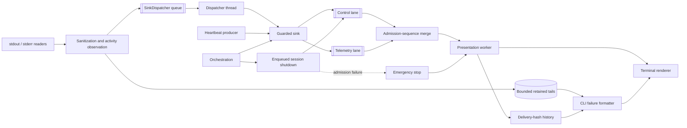
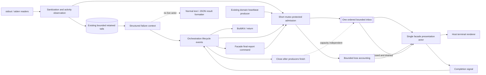

## Context

See `proposal.md` for motivation. Phases 1–8 and an initial Phase 9 implementation already exist. The current code is the migration baseline, not the target architecture: `docker/npm_environment/streaming.py` has two reader threads, independent bounded tails, and a `SinkDispatcher` queue/thread; `docker/versioning/activity_monitor.py` produces presentation-neutral heartbeat facts; `docker/versioning/host_presentation.py` has a two-lane mailbox, sequence merge, omission fallback generations, one presentation worker, and shutdown-barrier/emergency paths. `docker/constructor_cli.py` currently reconciles a failure tail with the worker's bounded delivery-hash history. Session shutdown first waits five seconds but can subsequently wait indefinitely for the worker.

Review scenarios exposed four distinct concerns: FIFO cannot repair a terminal event admitted before upstream producers finish; a shutdown message can fail admission; exact replay suppression cannot be reconstructed from safe-text hashes after loss and tail truncation; a blocked terminal write cannot be cancelled safely in a Python thread. These are not all coalescing defects. The agreed revision simplifies the contracts around the existing actor instead of introducing another coordinator.

Existing security, SDK, domain heartbeat, fixed npm deadline, locking, cache, and cleanup contracts remain authoritative. `verification-phase9.md` records the previous implementation's checks; it is not acceptance evidence for this revised architecture. New migration evidence belongs in a separate verification file during implementation.

## Goals / Non-Goals

**Goals:**

- Keep one facade presentation actor as the sole owner of grouping, presentation deadlines, mutable terminal state, and host terminal writes.
- Reduce the internal reader-to-presentation path to one bounded ordered inbox; keep retained diagnostics independent of presentation speed and success.
- Preserve normal interactive/lines coalescing while permitting safe repeated diagnostics under degradation and explicitly labeled retained-context replay for every failure.
- Define a simple producer-completion/close protocol and a single five-second presentation completion budget.
- Preserve testable activity facts, privacy, bounded memory, SDK compatibility, and primary execution results.

**Non-Goals:**

- Exactly-once diagnostic display, occurrence-aware delivery receipts, or reconciliation of live output with retained tails.
- Wait-free/lock-free queue guarantees or real-time terminal delivery under overload.
- Guaranteed termination of a thread blocked indefinitely in terminal I/O, or perfect terminal handoff after such failure.
- A new combined activity/presentation coordinator, asyncio conversion, terminal subprocess, or nonblocking terminal backend.
- Changes to acquisition effects, the 30-minute assembly deadline, blocking coordination, cleanup ownership, or the already accepted npm logging policy/identity.
- Docker CPU/network/filesystem probes, inferred npm download activity, unavailable percentages/rates, or adaptation of `reconstructed-from-photos.patch`.

## Decisions

### Current and target ownership

Current implementation (internal live path; external SDK variants omitted):



Target internal path:



The collector owns sanitization and the retained tail. The activity monitor owns observed activity and heartbeat facts. The actor owns presentation only. The orchestrator owns producer lifetimes and terminal ordering. A stalled actor must not become a collector or executor dependency.

The target bypasses the existing asynchronous `SinkDispatcher` only for the explicitly identified facade-owned enqueue path. Preserve its isolation and callback behavior for arbitrary external SDK sinks. Do not infer that an arbitrary callable is a safe enqueue adapter or expose output policy to the assembler. Verify the internal path has one asynchronous presentation hop and the external path retains its existing contract.

### Keep lifecycle and domain activity stable

Keep `HostPhaseEvent` classifications and the immutable operational event union. Operational facts retain phase, step, diagnostic-stream applicability, stream, safe logical resource, sanitized text, normalized host facts, and ephemeral URL identity where applicable. No domain event contains terminal escapes or output policy. Facade-only final-report commands and inbox lifecycle state are not new domain events; remove the old facade shutdown marker from the domain union if it has no remaining caller.

Keep `HostActivityMonitor` rather than merging it into presentation. It observes every stdout/stderr chunk before live admission; host transport chunks update cumulative bytes and last transport activity without extra requests or buffering. First heartbeat remains at 3 seconds, then at intervals no greater than one second, independent of activity. Diagnostic silence is applicable only to declared diagnostic streams, resets only on stdout/stderr, and is exposed from 120 seconds. Last-activity age is omitted before one whole second; remaining deadline exists only where execution already owns one.

Never infer silence or timeout by counting consecutive heartbeats consumed by the actor. Diagnostics can be dropped, heartbeats can be superseded, and the actor can lag. Silence is an observation, not proof of inactivity. The executor's existing monotonic total deadline remains the authority for termination. Tests retain exact injected-clock domain cadence while presentation timing expectations apply to a healthy, promptly serviced actor.

### One ordered inbox with short critical sections

Use one physical FIFO with independently bounded admission budgets for control and telemetry. Diagnostic traffic cannot consume control capacity. Set `CONTROL_CAPACITY = 1024` as an intentional hard safety limit with substantial headroom over every supported build transcript, not as a calculation of the exact current transcript from enum members, artifact counts, Pi release assets, assembly steps, or other module inventory. Adding, removing, or replacing a supported operation does not require changing this limit while its transcript remains within the hard bound. Verify realistic success and failure/final-report transcripts independently of the capacity constant; those tests own exact production event order and multiplicity, while the fixed capacity owns bounded memory and runaway protection. A separate boundary test SHALL fill all 1024 control slots and require the next admission to disable presentation explicitly rather than block execution or silently drop a control. Such exhaustion denotes runaway or unsupported control production and preserves the primary result.

One short mutex/condition critical section owns acceptance state, enqueue/dequeue, bounded drop accounting, and wakeup state. Admission may briefly contend for this mutex; it does not wait for queue capacity, rendering, I/O, callbacks, or consumer acknowledgement. This is not a wait-free or hard real-time promise. Render, flush, callback invocation, completion waiting, and thread join occur outside every mailbox/producer serialization lock. Do not retain redundant nested facade guards merely to protect a thread-safe inbox; preserve external sink serialization compatibility.

Retained FIFO events are processed in admission order. If heartbeat/progress supersession is retained, remove the older eligible update and append the replacement at the current admission point; never overwrite an earlier position with a later observation or supersede across operation terminal/restart boundaries. Dropping replaceable updates is an acceptable alternative. It must not inflate diagnostic omission accounting.

Diagnostic admission is best effort. Keep one bounded count or loss flag, not identity-indexed maps or fallback marker generations. Associate pending loss information with a subsequent admitted diagnostic/control or final close using the same mutex as admission, so it cannot be retroactively attached ahead of older events already taken by the consumer. The actor renders a non-coalesced notice when possible. Report an exact count only when known; saturation or uncertainty uses a lower bound or a generic omission notice. No exact reconstruction of producer ordering/multiplicity is promised. Pending loss must also be surfaced on normal close when no later diagnostic arrives.

Control-admission failure explicitly marks presentation aborted, rejects further admissions, wakes the consumer without consuming a slot, and preserves the primary result. This signal does not wait for rendering or worker termination. Brief mailbox mutex contention is not an emergency or a drop by itself.

### Producer completion, terminal events, and inbox close

A FIFO orders admissions, not the completion of independent producers. An exited npm process may still have unread pipe data; a finished reader may leave events in an external dispatcher. Orchestration must establish completion before publishing a terminal event:

```mermaid
sequenceDiagram
    participant O as Orchestration / facade thread
    participant R as Readers and sanitizer
    participant D as External dispatcher, if present
    participant H as Heartbeat producer
    participant Q as Ordered inbox
    participant A as Presentation actor

    O->>R: Observe process termination; drain and join
    R-->>O: EOF / safe finalization complete
    opt External callback path has dispatcher
        O->>D: Drain accepted callbacks and finish
        D-->>O: No more diagnostic callbacks
    end
    O->>H: Mark terminal, reject activity, stop and join
    H-->>O: No more heartbeat callbacks
    O->>Q: Admit step terminal
    A->>Q: Consume earlier admitted events, then terminal
    A->>A: Finalize group, render terminal; persist for next step
    opt End of host presentation session
        O->>Q: Admit facade final failure report, if any
        O->>Q: Close acceptance and wake consumer
        Note over O,A: One shared five-second monotonic completion budget
        A->>Q: Drain accepted events until closed and empty
        A->>A: Finalize, clear region, stop
        A-->>O: Completion signal
        O->>A: Join using only remaining budget
        O->>O: BuildKit / return
    end
```

Session `close()` is idempotent inbox state, not an enqueued shutdown event and not subject to capacity. Admission and close linearize under the same short lock: an accepted event precedes close; later attempts are rejected. Step terminals remain control events in the FIFO and do not stop the session actor. Per-step acknowledgement is not required for domain execution; final session completion establishes normal terminal handoff.

Normal completion drains accepted events, finalizes grouping and pending loss notices, clears transient state, signals completion, and joins the actor before native BuildKit output or return. No rendering occurs after successful completion acknowledgement. Cancellation and host failure use the same orchestration-owned completion ordering without changing producer cleanup or the primary exception/result.

### One five-second completion budget, including renderer stalls

All presentation shutdown waits, drain confirmation, completion acknowledgement, and join share one real monotonic deadline of five seconds. Repeated cleanup calls are idempotent and must not restart that deadline. Producer/subprocess cleanup retains its existing separate contract; this budget covers presentation only.

A renderer exception disables further rendering, discards grouping/transient pending state without retrying the failed stream, and lets the actor consume/discard remaining events until close. Control-capacity failure or unexpected actor failure also disables the session and wakes waiters; no absent event acknowledgement is awaited. The primary operation result is unchanged.

If a renderer blocks indefinitely, producers continue, memory remains bounded, and shutdown returns when the shared budget expires. Signal cancellation and do not enter an unbounded `wait()` or `join()`. A blocked daemon thread may remain alive; it may complete the already-started write if I/O later unblocks. Check cancellation before any further renderer operation, including flush/clear/fallback attempts. Do not synchronously retry the final report through CLI to the same failed stream. Clean terminal handoff, final-message visibility, and absence of a live presentation thread are explicitly not guaranteed on this degraded path. These guarantees remain required on healthy and returning-error paths.

A thread cannot safely cancel arbitrary blocking Python I/O. A presentation subprocess or interruptible output backend would be a separate change if stronger guarantees become necessary.

### Best-effort coalescing, independent retained context

Keep the existing pure coalescer and its normal-path tests. With healthy rendering and admitted events, interactive diagnostics use one mutable slot, exact repeats increment the admitted count, and strict one-token numeric variants replace the latest value and reset its count. Finalization writes the latest value once before the next diagnostic/terminal. `lines` emits the first line immediately and the canonical ` (repeated N times)` summary within a fixed one-second window; numeric values remain separate lines. Warnings/errors do not bypass grouping. The precise numeric grammar and URL identity/security rules remain in the locked-assembly delta spec.

These are normal-path behavior, not an exactly-once delivery protocol. Loss, state reset, or presentation failure may produce extra groups/repeats or no live display. A displayed repetition count must never claim dropped producer occurrences. Privacy, identity-safe grouping, bounded memory, and primary-result isolation are not best effort.

Reuse the existing byte-bounded sanitized failure tail without comparing it to live delivery. Include it once in each final report under an explicit retained-context label stating that live output may be repeated, for ordinary exit failures as well as timeouts. An empty tail produces no diagnostics section. Keep summary, tail, and phase/step/resource/type context structurally separate; do not append a legacy message that already embeds the tail, or infer a tail from an explicitly empty structured field. Transport failures without stream output use safe resource/type context instead.

Remove `DeliveredDiagnostic`, `_unseen_tail`, delivery-hash windows, and facade reads of actor delivery history. No replacement occurrence receipt protocol or second capture buffer is needed. Truncation notices remain collection facts, distinct from best-effort presentation omission notices.

### Single terminal writer and native handoff

During an authorized live session the facade actor is the sole host terminal writer, including the facade-prepared final failure report. Enqueue a facade-only immutable final-report command before close. Preserve the structured result for SDK/JSON, but prevent the normal CLI result printer from writing that same report again; record explicit routing/ownership, not text matching or inferred delivery. If report admission/rendering fails, preserve the result without synchronous fallback to the failed stream. Audit ancillary host-build messages for writes that would bypass this owner.

Without a live session, retain ordinary text/JSON result formatting; JSON never creates an actor or inbox and remains one valid document. Default noninteractive text has no live sink; explicit `lines` does. `off` suppresses displayed heartbeats only. Output mode and hostname policy stay in the facade; domain activity collection is identical for every mode.

Transient terminal output is clipped to one physical line using terminal display width, leaving room to avoid automatic wrap; full durable diagnostics are not clipped. Preserve the current narrow-terminal/wide-character regression coverage and add actual terminal-state checks for replacement/finalization/handoff. A single-line erase cannot remove previous wrapped rows. Renderer tests must not confuse this layout defect with a synchronization defect.

### Preserve established security and execution decisions

The shared output-policy-independent projector remains before both branches. Preserve secret redaction, URL-free retained/live text, normalized optional hostname facts, the 8 KiB pending sanitizer limit, 64 KiB line assembly limit, fail-closed oversized/incomplete markers, continued drain and recovery, existing per-stream tail byte limits, and bounded exception-type projection without nested exception-message evaluation.

Preserve ephemeral session-keyed URL fingerprints and strict numeric matching from Phase 7. They never enter rendered output, retained tails, evidence, persistence, or failure reports. Best-effort grouping permits failure to group, not unsafe grouping of distinct hidden identities or disclosure.

Keep local `[output]` parsing/defaults and host-only confinement from Phase 4; no CLI/environment aliases. Preserve the accepted Phase 6 `--loglevel=http` policy and Phase 8 policy/evidence/cache identity change. This architecture revision introduces no further policy identity change. Acquisition uses only already-observed chunks, with no extra request, total-size requirement, buffering, checksum reordering, or cleanup changes.

## Test Expectation Migration

Tests are changed with implementation, not merely weakened until the old code passes. Retain deterministic normal-path assertions; replace assertions whose guarantees were deliberately removed.

| Current tests / assumption | Revised expectation |
| --- | --- |
| `test_host_presentation_phase9.py`: physical lane layout and cross-lane merge | One FIFO preserves accepted-event order; independent control/telemetry admission limits; saturation cannot spend control reserve |
| Same file: mailbox-lock contention triggers emergency; omission fallback generations | Short mutex contention is allowed; no capacity/I/O/ack wait or rendering under locks; bounded honest omission accounting without generation-specific seams |
| Same file: shutdown sentinel admission and unadmitted-shutdown ack | Full inbox closes without a slot; close/admission race is linearized; repeated close is idempotent; healthy drain ends in completion and join |
| Same file: unconditional worker termination / stop wait | Healthy and returning-error workers stop; blocked renderer cannot extend the shared five-second deadline; cancellation prevents subsequent writes after release |
| Same file: normal coalescing, URL identity, modes, clock cadence, hostname formatting | Keep these assertions on the healthy path; do not assert exactly-once output across loss/reset/failure |
| `test_host_failure_output_regression.py`: `DeliveredDiagnostic`, `_delivered`, partial-delivery filtering and no-live-replay tests | Full bounded retained tail appears once per final report with a repeat warning, regardless of prior live output, drops, more than 512 occurrences, or earlier identical lines; no delivery receipts |
| Same file: empty exit/timeout and narrow-terminal regressions | Preserve no empty section/no summary-as-tail and complete durable text with clipped transients |
| `test_host_operational_events.py` / `test_constructor_host_progress.py`: old facade mailbox assumptions | Update internal adapter tests; preserve optional sink serialization and failure isolation for external callers |
| `test_npm_environment_streaming.py` and Phase 8 collector tests | Internal known enqueue path bypasses dispatcher, external SDK callback path retains it; both preserve safe drain, tails, activity, cleanup, and producer-before-terminal ordering |
| CLI/orchestration integration | Live actor alone writes final host report before close; no duplicate CLI write or failed-stream fallback; no-live text/JSON still formats the same structured failure |

Use deterministic clocks and thread gates rather than scheduler luck. Stall the renderer with a releasable gate: assert domain progress and bounded session return before releasing it, then release and join the test thread to avoid test-suite leaks. Check one cumulative budget across repeated cleanup calls. Tests of control failure must preserve success, operational failure, timeout, and cancellation independently of whether output is visible. Busy-queue tests must keep actor deadlines from starving.

## Risks / Trade-offs

- **[Retained context repeats live output]** → Label it explicitly; retain normal coalescing; do not silently hide unseen errors to avoid cosmetic repetition.
- **[Brief mutex contention]** → Keep critical sections bounded and free of I/O, callbacks, waits for capacity, and joins; do not claim wait-free behavior.
- **[Control bound is underestimated]** → Test supported repeated operations and final-report admission; disable presentation explicitly on exhaustion without changing the primary result.
- **[Stalled output leaves a daemon thread or late in-flight write]** → Use one five-second deadline, cancellation checks before subsequent writes, no synchronous retry, and document degraded handoff. Stronger I/O isolation is out of scope.
- **[Bypassing dispatcher affects SDK callers]** → Explicitly distinguish the internal enqueue capability and preserve arbitrary-callback isolation and existing injection signatures.
- **[Lost diagnostics distort silence inference]** → Observe chunks before admission and use authoritative monotonic facts, never consumed heartbeat counts.
- **[Privacy or capture bounds regress during simplification]** → Keep projection, tail, identity, confidentiality, and cleanup suites unchanged except for transport-path seams.

## Migration Plan

1. Treat completed Phases 1–8 and retained normal Phase 9 behavior as the baseline. Reopen incompatible Phase 9 tasks; do not claim old verification proves the new contract.
2. Add RED tests for the revised inbox, close/control failure, single completion budget, retained-context reporting, and final-writer routing. Replace obsolete white-box lane/fallback/receipt tests with behavioral tests; preserve normal coalescing and security coverage.
3. Simplify the inbox and session lifecycle behind the existing facade actor. Retire redundant Phase 1 mailbox scaffolding if unused; preserve external sink compatibility.
4. Add the explicit internal direct-enqueue path and verify producer completion ordering; retain the SDK dispatcher path.
5. Remove delivery reconciliation and route final failure reports through the live actor or ordinary no-live formatter, never both.
6. Validate blocked-renderer degradation, normal native handoff, all mode/privacy/SDK matrices, collector/executor regressions, and repository checks. Store new evidence separately from this design and the old Phase 9 report.
7. Update user-facing documentation with retained-context replay and bounded presentation-failure behavior. This revision needs no data/cache migration; rollback of presentation changes must not revert the already accepted npm policy/evidence identity.
