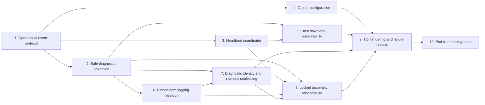

# Implementation Binding Contract

Every checkbox in this document is required for completion. A phase is complete only when all of its RED → GREEN → INTROSPECT → VALIDATE tasks pass and every listed deliverable exists. RED tests SHALL fail for the intended missing behavior before GREEN begins. GREEN work SHALL be limited to satisfying that phase's RED contract and SHALL NOT implement behavior owned by a later phase. INTROSPECT SHALL review the resulting diff against the phase boundaries and named invariants. VALIDATE SHALL run the stated focused checks and record their success. Newly discovered scope or a decision that contradicts proposal, specs, or design SHALL be returned to the planning artifacts before implementation continues.

A phase MAY depend only on lower-numbered phases named in its `Depends on` field. Completion evidence from a later phase SHALL NOT substitute for an incomplete dependency.

## Architecture Revision Baseline and Test Expectations

The current code already implements Phases 1–8 and an earlier Phase 9 design. Checked tasks below preserve completed, still-applicable work; reopened Phase 9 tasks and new tasks 9.17–9.23 implement the approved simplification. `verification-phase9.md` is historical evidence for the previous architecture, not proof of the revised contract. Do not rewrite that evidence or mark migration tasks complete merely because the old suite passes.

For facade admission, previous references to "non-blocking" now mean no waiting for queue capacity, I/O, rendering, or consumer acknowledgement; a short mutex critical section is permitted. Normal-path coalescing/timing tests remain required, while degraded presentation is best effort. Tail replay is explicitly labeled and permitted; privacy, bounded capture, primary results, producer cleanup, and domain heartbeat/deadline semantics remain mandatory. The five-second presentation completion budget is distinct from subprocess/heartbeat cleanup budgets.

Phase 9 migration may modify the earlier internal enqueue/streaming integration seams needed to remove the redundant dispatcher hop, but SHALL preserve external SDK callback isolation, Phase 2/7 security, Phase 3 activity facts, and Phase 8 execution policy/cleanup. This is the only approved extension of its earlier boundary. Execute revised RED tasks 9.9–9.10 and 9.17–9.19 before their GREEN tasks; unchanged normal behavior needs regression verification, not an artificial new RED failure. Task 9.23 reconciles obsolete white-box expectations with these RED contracts, not by skipping failing coverage.

| Existing test coverage | Required migration |
| --- | --- |
| `tests/test_host_presentation_phase9.py`: lanes/sequence merge, lock-contention emergency, omission fallback generations | Replace implementation-specific assertions with one FIFO, independent admission budgets, short-lock admission, bounded honest loss notice, and explicit control-exhaustion degradation |
| Same file: shutdown sentinel and unconditional stop/join | Test capacity-independent close, close/admission races, normal drain/join, one shared five-second deadline, and no later writes after a gated stall is released |
| Same file: healthy interactive/lines/off, identities, cadence, hostname matrix | Retain deterministic normal-path assertions, including canonical suffix and no warning/error bypass |
| `tests/test_host_failure_output_regression.py`: delivery-hash fixtures, partial-tail filtering, no-live-replay assertions | Replace with one complete labeled retained tail per final report, no receipts/reconciliation, independent of prior output, more than 512 occurrences, numeric replacement, truncation, or dropped identical diagnostics |
| Same file: empty exit/timeout and narrow-terminal coverage | Retain empty-tail authority, no summary-as-tail, complete durable text and no stale transient rows |
| `tests/test_host_operational_events.py`, `tests/test_constructor_host_progress.py` | Update internal adapter assumptions without changing optional external sink serialization/failure isolation |
| `tests/test_npm_environment_streaming.py`, Phase 8 collector/executor tests | Verify explicit internal direct enqueue and unchanged external SDK dispatcher path, safe reader drain and finalization before terminal |
| CLI/orchestration acceptance | Actor is sole live host writer including final failure report; preserve structured/no-live formatting; no duplicate CLI write or synchronous failed-stream retry |

Test stalls with releasable gates and a deterministic completion-clock seam; prove bounded return before releasing the gate, then release/join the test worker. Do not require an indefinitely blocked worker to be absent at the degraded return boundary. Production cancellation must prevent subsequent renderer operations after unblocking.

Phase dependency DAG:

## 1. Operational Event Protocol

**Depends on:** none

**Deliverables:** one immutable presentation-neutral operational event union for closed host steps with explicit diagnostic-stream applicability, step terminal states, observed transport progress, heartbeat facts with optional applicable diagnostic silence and closed last-activity kind/whole monotonic age in seconds of at least one, and structured safe diagnostics containing URL-free text plus separately normalized host facts; no wall-clock activity timestamp or output-policy-dependent domain payload; unchanged `HostPhaseEvent` lifecycle semantics; optional failure-isolated serialized sink compatibility; a prompt-returning bounded non-blocking facade enqueue adapter with no rendering, acknowledgement wait, flush, or presentation stop/join while `GuardedHostEventSink` serialization is held; no terminal presentation in domain events.

- [x] 1.1 **RED:** Add event-construction tests requiring closed phase, step, terminal-state, diagnostic-stream applicability, diagnostic-stream, and last-activity-kind members; require diagnostic silence to be absent when the step declares no expected diagnostic stream; require last-activity kind/age to be jointly absent or jointly valid with a whole monotonic age in seconds of at least one, reject fractional/sub-second/zero/negative age and wall-clock timestamps, open strings, and invalid value types, and verify the focused test fails because the operational event union does not exist.
- [x] 1.2 **RED:** Add lifecycle-compatibility tests proving one existing `HostPhaseEvent` started/terminal pair is neither replaced nor mutated by operational events; verify the focused test fails on missing operational-event support.
- [x] 1.3 **RED:** Add sink tests requiring operational and lifecycle events to share serialized failure-isolated delivery while an omitted or throwing sink cannot affect the primary operation result; instrument the guarded lock and require the facade adapter to perform only bounded non-blocking enqueue and return promptly under saturation, with no renderer call, barrier wait, flush, or presentation worker/timer join while serialization is held; verify the focused test fails on missing union plumbing.
- [x] 1.4 **GREEN:** Implement the closed immutable operational DTOs and extend the host event union with no formatting or exception objects; verify task 1.1 passes.
- [x] 1.5 **GREEN:** Extend guarded sink typing and delivery to the operational union without changing lifecycle emission, and provide only the prompt-returning bounded enqueue boundary needed by the facade; verify tasks 1.2–1.3 pass.
- [x] 1.6 **INTROSPECT:** Review the phase diff for free-form step names, mutable payloads, exception/message leakage, terminal escapes, direct printing, lifecycle expansion, or changed sink-failure semantics; correct only protocol-boundary defects found.
- [x] 1.7 **VALIDATE:** Run focused host-event, lifecycle-ordering, sink-serialization, saturated-enqueue prompt-return, no-render/no-wait/no-join-under-lock, absent-sink, and sink-failure tests; record that all Phase 1 deliverables pass and existing `HostPhaseEvent` consumers remain compatible.

## 2. Safe Diagnostic Projection

**Depends on:** Phase 1

**Deliverables:** one pure output-policy-independent shared projector producing structured safe diagnostics with logical asset/container context, existing secret redaction, URL-free sanitized text, separately normalized hostname facts, closed classification, and deterministic exception-type chains of at most four unique names; pending ambiguous URL/secret state bounded to 8 KiB across arbitrary chunking, with fixed fail-closed overflow and incomplete-candidate markers, discard through the next safe boundary, safe EOF/reader-failure/cancellation finalization, and recovery after a boundary; no diagnostic behavior based on exception-message substring matching.

- [x] 2.1 **RED:** Add logical-context tests requiring safe identifiers for reviewed assets and `npm-assembler-<digest-prefix>` while rejecting arbitrary resource labels; verify failure against the missing projector.
- [x] 2.2 **RED:** Add structured-host tests requiring identical output-policy-independent diagnostics with URL-free text and separately normalized hostname facts while scheme, port, userinfo, path, query, fragment, and proxy details never enter the event; verify failure against current text-only diagnostics.
- [x] 2.3 **RED:** Add malformed, encoded, and arbitrarily chunk-split URL-token tests, including split credentials, encoded URL forms, and incomplete secret/URL prefixes delivered across many small chunks; require pending sanitizer state never to exceed 8 KiB, complete candidates to be replaced without partial source identifier exposure, oversized candidates to emit only `[sanitized oversized token]` while their remainder is discarded through a safe boundary, processing to recover after that boundary, and EOF, reader failure, or cancellation to emit only `[sanitized incomplete token]` for unresolved candidates; verify failure against current redaction alone.
- [x] 2.4 **RED:** Add exception-graph tests requiring deterministic `reason` → `__cause__` → `__context__` traversal, object-cycle termination, duplicate-type suppression, and a four-unique-type limit without evaluating exception messages; verify failure against outer-type-only reporting.
- [x] 2.5 **GREEN:** Implement validated logical diagnostic context and the pure output-policy-independent URL/hostname projector after existing secret redaction; cap ambiguous URL/secret pending state at 8 KiB, implement fixed fail-closed overflow and incomplete-candidate markers, discard overflow through the next safe boundary, recover after that boundary, and finalize EOF, reader failure, and cancellation without flushing unresolved text; emit URL-free text and separately normalized host facts and verify tasks 2.1–2.3 pass.
- [x] 2.6 **GREEN:** Implement bounded deterministic exception-type projection without string-message inspection; verify task 2.4 passes.
- [x] 2.7 **INTROSPECT:** Review the phase diff and adversarial fixtures for credentials, signed queries, IPv4/IPv6, IDN, encoded delimiters, malformed or incomplete candidates, proxy forms, cycles, exception `__str__` side effects, unbounded token buffering, unresolved ordinary-text flushes, and failure to recover after a safe boundary; correct every disclosure, bound violation, or nondeterminism found without adding transport instrumentation.
- [x] 2.8 **VALIDATE:** Run focused structured-diagnostic, redaction, URL-sanitization, normalized-host extraction, exception-chain, terminal-finalization, many-small-chunk, overflow/recovery, and property/fuzz-style fixture tests; record that pending sanitizer state stays within 8 KiB, no event text contains an original network identifier or unresolved candidate fragment, every host fact is normalized, terminal paths fail closed, processing recovers after a safe boundary, and projection has no output-policy input.

## 3. Heartbeat Coordinator

**Depends on:** Phase 1

**Deliverables:** one orchestration-owned activity coordinator with injected monotonic clock and waiter; activity-independent first heartbeat 3 seconds after operation start and subsequent fact cadence no greater than 1 second; a separate applicability-gated diagnostic-silence clock reset only by stdout/stderr and exposed exactly from 120 seconds only for operations with an expected diagnostic stream; latest observed `diagnostic` or `transport_progress` activity kind and monotonic age; omission before first activity; optional remaining deadline; bounded stop/join ownership; no rendering or inactivity inference.

- [x] 3.1 **RED:** Add fake-clock tests requiring the first heartbeat exactly 3 seconds after operation start and subsequent intervals no greater than 1 second regardless of intervening stdout/stderr or transport progress; verify failure against the missing coordinator.
- [x] 3.2 **RED:** Add fake-clock tests requiring diagnostic-silence reporting exactly from 120 seconds without stdout/stderr and continued updates only when the step declares an expected diagnostic stream, complete omission otherwise, and stdout/stderr reset of only that separate clock; verify failure against the missing coordinator.
- [x] 3.3 **RED:** Add separation tests proving transport progress updates general last activity but resets neither diagnostic silence nor heartbeat cadence; verify failure against the missing coordinator.
- [x] 3.4 **RED:** Add last-activity tests requiring the latest observed kind to be `diagnostic` or `transport_progress`, its age to derive from the injected monotonic clock and round down to whole seconds, a newer observation to replace both values, both fields to remain absent before the first observation or while age is below one second, and heartbeat timing not to wait for that threshold; verify ages below one are rejected and the focused test fails against the missing coordinator.
- [x] 3.5 **RED:** Add deadline tests requiring nonnegative remaining time only for operations that already own a fixed deadline and wording-neutral facts that never claim process or network inactivity; verify failure against the missing coordinator.
- [x] 3.6 **RED:** Add race-controlled lifecycle tests proving success, failure, timeout, and cancellation atomically mark terminal/reject activity, stop and join heartbeat production, and only then deliver the terminal event; require no heartbeat after terminal delivery and preserve absent/throwing-sink primary results.
- [x] 3.7 **GREEN:** Implement the activity-independent heartbeat schedule, applicability-gated stdout/stderr-only diagnostic-silence clock, latest-activity kind/time state, and presentation-neutral heartbeat projection with injected clock/waiter; verify tasks 3.1–3.5 pass.
- [x] 3.8 **GREEN:** Implement atomic terminal transition, later-activity rejection, and bounded heartbeat stop/join before terminal event emission across every terminal path; verify task 3.6 passes.
- [x] 3.9 **INTROSPECT:** Review the phase diff for coupled heartbeat/activity timers, transport-driven diagnostic-silence reset, mislabeled silence, wall-clock activity timestamps, ambiguous initial activity, negative/stale ages, real sleeps in tests, unbounded joins, post-terminal callbacks, renderer dependencies, inferred network/process status, or changed operation exceptions; correct only coordinator defects found.
- [x] 3.10 **VALIDATE:** Run focused fixed-cadence, diagnostic-silence separation/reset, transport-progress non-reset, last-activity replacement/omission, deadline, cancellation, interruption, concurrency, absent-sink, and throwing-sink tests; record that timer semantics remain distinct and no test leaves a coordinator thread alive.

## 4. Output Configuration

**Depends on:** implemented, synchronized, and archived `extract-local-project-configuration`, plus Phase 1

**Deliverables:** prerequisite-owned host-only local companion extended so its closed aggregate table contract accepts `[output]` while rejecting every other unknown top-level table, with `[output]` fields remaining owned by `docker-build-output`; `host_heartbeat = "interactive" | "lines" | "off"` defaulting to `interactive` and `show_network_hosts = false`; independence from host-access, cache, corporate-trust, and proxy tables; strict rejection of unknown, misplaced, duplicate, unsupported, and wrongly typed output settings with safe local-path errors; exclusion from reviewed inventory serialization/update discovery, effective build/runtime dependency projections, build contexts, and build/runtime containers; output policy retained only by facade presentation, with domain event production unchanged; no new CLI/environment aliases; JSON and SDK compatibility preserved.

- [x] 4.1 **RED:** Verify the archived predecessor's aggregate local-companion, cache safety/default, host-access, corporate-network, projection, and host-only confinement regression suites pass unchanged before adding `[output]`; add aggregate-resolver tests requiring valid `[output]` to be accepted independently of host-access, cache, corporate-trust, and proxy tables while every other unknown top-level table remains rejected; stop if the prerequisite is not archived or any inherited contract fails.
- [x] 4.2 **RED:** Add output-owner tests requiring both defaults when `[output]` is absent, exact parsing of all three heartbeat values and both hostname booleans, and rejection of unknown output keys, wrong types, unsupported values, duplicate definitions, and misplaced settings; add reviewed-inventory rejection tests for both output keys and verify safe path-specific failures.
- [x] 4.3 **RED:** Add facade-construction, projection, and confinement tests requiring output policy to remain absent from reviewed serialization/update discovery, effective build/runtime projections, build contexts, build/runtime containers, and build, materialization, transport, assembler, verification, operational-event-production, or runtime requests; verify failure against current models.
- [x] 4.4 **GREEN:** Update the prerequisite-owned closed aggregate table contract to register `[output]`, while keeping its field validation and semantics owned by `docker-build-output` and without changing host-access, cache, corporate-trust, or proxy schemas; implement the domain-owned parsing and defaults and verify tasks 4.1–4.2 pass.
- [x] 4.5 **GREEN:** Retain immutable output policy only in facade presentation construction without selecting/rendering a sink or propagating it into domain requests; verify task 4.3 passes.
- [x] 4.6 **INTROSPECT:** Review the phase diff for predecessor-contract changes, reviewed-inventory acceptance or mutation, projection or container leakage, accidental persistence, propagation beyond facade construction, CLI/environment aliases, permissive unknown/misplaced/duplicate keys, unsafe path errors, or changed JSON behavior; correct only output configuration defects found.
- [x] 4.7 **VALIDATE:** Run focused predecessor regression, aggregate-resolver `[output]` acceptance and cross-table independence, rejection of every other unknown top-level table, reviewed-inventory rejection, output defaults/acceptance/rejection, reviewed serialization/update-discovery exclusion, effective projection and build/runtime confinement, request-construction, CLI/environment-source absence, and JSON compatibility tests; record the exact defaults, closed accepted output surface, aggregate unknown-table rejection, safe rejection behavior, and presentation-only propagation.

## 5. Host Download Observability

**Depends on:** Phases 2 and 3

**Deliverables:** operational start/cache/byte-progress/terminal events for reviewed build artifacts and Pi release assets that declare no expected diagnostic stream; mandatory cumulative byte counts and latest `transport_progress` updates for every body chunk already exposed by the acquisition boundary, with omission only for compatible transports that cannot expose chunk observation without semantic change; no diagnostic-silence value for host downloads; safe logical failure attribution and bounded type chains; unchanged request count, streaming, checksum, atomic publication, and cleanup semantics.

- [x] 5.1 **RED:** Add reviewed build-artifact tests requiring logical start, verified-cache-hit, success, and failure activity in execution order; verify failure against uninstrumented materialization.
- [x] 5.2 **RED:** Add transport tests requiring every body chunk already yielded by the acquisition boundary to update cumulative received bytes/latest `transport_progress` for the next heartbeat, while allowing omission only for a compatible transport that cannot expose chunks without `Content-Length`, an extra request, buffering, or semantic change; require diagnostic-silence omission and unchanged heartbeat cadence, and verify failure against uninstrumented streaming.
- [x] 5.3 **RED:** Add build-artifact failure tests requiring logical artifact identity and shared safe exception projection with no URL, proxy, credential, or exception-message leakage; verify failure against current outer-type errors.
- [x] 5.4 **RED:** Add Pi release tests requiring distinct safe activity/failure context for `SHA256SUMS`, install package, and install lock while preserving acquisition and checksum order; verify failure against undifferentiated release transport errors.
- [x] 5.5 **GREEN:** Instrument reviewed build-artifact selection/cache/stream/terminal boundaries so every already-yielded body chunk updates cumulative bytes and latest transport activity for heartbeat publication, with an explicit compatibility path for transports that cannot expose chunks without semantic change; verify tasks 5.1–5.3 pass.
- [x] 5.6 **GREEN:** Instrument the three Pi release acquisitions through the same activity and safe failure context; verify task 5.4 passes.
- [x] 5.7 **INTROSPECT:** Review the phase diff for extra network calls, eager buffering, duplicate downloads, required byte totals, percentage/rate claims, URL retention, checksum reordering, changed cache admission, or cleanup regression; correct only acquisition-observability defects found.
- [x] 5.8 **VALIDATE:** Run focused host materialization, Pi release, transport, digest, cache-hit, atomic-publication, cleanup, redaction, and activity-order tests; record unchanged effect counts, mandatory progress for exposed chunks, and omission only on the compatibility path.

## 6. Pinned npm HTTP Logging Research

**Depends on:** Phase 2

**Deliverables:** a reproducible controlled harness for pinned npm 11.16.0 in the reviewed Node image; captured raw and safely projected cache-hit, cache-miss, retry, and timeout observations under `loglevel=http`; measured live timing and output volume; one committed research report with an explicit accept/reject decision against design criteria; no production policy change in this phase.

- [x] 6.1 **RED:** Add a controlled local registry/failure harness test that requires deterministic cache-hit, cache-miss, retry, and timeout scenarios without public-registry timing; verify the harness test fails before its fixtures are implemented.
- [x] 6.2 **RED:** Add research-contract checks requiring the report to identify exact Node/npm/image inputs, command/environment, raw fixtures, projected fixtures, first-observation timing, line volume, sanitization result, and one accept/reject decision; verify failure while the report is absent.
- [x] 6.3 **GREEN:** Implement only the deterministic research harness and fixtures needed by task 6.1; verify all four controlled scenarios execute against pinned npm 11.16.0.
- [x] 6.4 **GREEN:** Run baseline and `loglevel=http` experiments through the existing stdout/stderr pipe model and write the research report with captured evidence and a binary decision; verify task 6.2 passes.
- [x] 6.5 **INTROSPECT:** Review raw/projected evidence for delayed-until-exit output, unstable fields, unsanitized network tokens, warning/error suppression, unbounded repetition, public-network dependence, or insufficient differentiation; correct the report or reject the mode rather than weakening acceptance criteria.
- [x] 6.6 **VALIDATE:** Re-run the research harness from a clean controlled cache and validate the report contract; record that another developer can reproduce the decision and that no production npm invocation, policy digest, evidence, or cache identity changed in Phase 6.

## 7. Diagnostic Identity and Numeric Coalescing

**Depends on:** Phases 2 and 6

**Deliverables:** conservative presentation identity for diagnostics containing hidden URLs and a pure coalescing semantic ready for facade integration; ordered fixed-width URL fingerprints derived with a cryptographic keyed digest and fresh random presentation-session key after userinfo, query, and fragment removal, with normalized hostname, path, scheme, and any explicitly supplied port preserved in digest input; no proxy contribution, rendering, persistence, evidence, failure-tail inclusion, or cross-session correlation; exact-repeat identity extended by phase, step, stream, classification, logical resource, final rendered text, and ordered URL-fingerprint tuple; interactive-only numeric-variant matching when otherwise identical diagnostics differ in exactly one unsigned dot-separated numeric token, replacing the mutable value without a suffix and resetting exact-repeat count; unchanged exact-repeat suffix semantics; separate changed numeric lines in `lines`; unchanged ungrouped retained tail; diagnostic activity observed before mailbox admission and grouping.

- [x] 7.1 **RED:** Add URL-identity tests requiring same-session equality for the same sanitized URL identity, distinction for different paths or explicit-port presence/value including explicit default ports, ordered multiplicity for multiple URLs, and removal of userinfo, query, fragment, and proxy information from fingerprint input; verify failure before ephemeral identity exists.
- [x] 7.2 **RED:** Add confidentiality and lifecycle tests requiring a cryptographic keyed digest with a fresh random key per presentation session, no ordinary fast/stable hash oracle, no cross-session correlation, fixed-width opaque values, and no key or fingerprint in rendered text, retained tails, failures, persistence, evidence, or policy identity.
- [x] 7.3 **RED:** Add pure exact-repeat identity tests requiring phase, step, stream, classification, logical resource, final safe rendered text, and ordered URL fingerprints to match; require diagnostics with the same redacted text but different hidden URL identity to form different groups while normalized hosts are not a separate key after final rendering.
- [x] 7.4 **RED:** Add conservative numeric-variant tests requiring the same identity metadata and numeric-token count, byte-identical surrounding nonnumeric text and unchanged numeric tokens, and exactly one changed strict maximal token consisting of one or more ASCII digits followed by zero or more `.` plus one-or-more-digit segments. Require maximal-token extraction with adjacent ASCII letter, digit, underscore, dot, plus, and minus boundaries disallowed, so no valid-looking substring can be extracted from an invalid numeric-looking sequence. Accept `progress 1` → `progress 2` and `version 1.2.3` → `version 1.2.4`; reject `value -1` → `value -2`, `value +1` → `value +2`, `value 1.` → `value 2.`, `value .1` → `value .2`, `value 1..2` → `value 1..3`, and `item1` → `item2`. Also reject zero or multiple changed tokens, identity mismatch, and URL-fingerprint mismatch; do not require monotonicity.
- [x] 7.5 **RED:** Add mode-state tests requiring interactive numeric variants to replace the mutable value, reset exact-repeat count to one, omit the repetition suffix until an exact repeat, and finalize only the latest value on mismatch, omission notice, or terminal event; require `lines` to emit every changed numeric value separately while retaining existing exact-repeat windows and require retained tails to remain ungrouped.
- [x] 7.6 **GREEN:** Implement ephemeral ordered URL fingerprints and extend structured safe diagnostic identity without changing rendered or retained diagnostic content; verify tasks 7.1–7.3 pass.
- [x] 7.7 **GREEN:** Implement the pure exact-repeat/numeric-variant matcher and mode-independent state transitions needed by the later facade worker, without adding a worker, timer, renderer, or production npm-policy change; verify tasks 7.4–7.5 pass.
- [x] 7.8 **INTROSPECT:** Review for hash-oracle exposure, unkeyed secret-derived identity, implicit default-port insertion, lost URL order/multiplicity, cross-session correlation, identity fields omitted from grouping, overbroad numeric matching, false progress claims, changed `lines` history, grouped retained tails, or activity updates delayed until presentation; correct every identity or grouping defect found.
- [x] 7.9 **VALIDATE:** Run focused identity, confidentiality, session-lifecycle, numeric-boundary, mode-state, explicit-port, multi-URL ordering, and existing sanitizer/tail tests; record that fingerprints are ephemeral and non-presentable, exact repeats remain unchanged, interactive numeric variants replace only one slot, `lines` retains each changed value, retained tails remain ungrouped, and activity precedes presentation.

## 8. Locked Assembly Observability

**Depends on:** Phases 2, 3, 6, and 7

**Deliverables:** ordered operational activity for coordination wait, cache lookup/reuse, stale-stage cleanup, container startup, npm execution, validation, and publication; `npm ci` declared as expecting a diagnostic stream; activity-independent heartbeat cadence; stdout/stderr-only diagnostic-silence reset and latest `diagnostic` activity age; no unsupported claim that npm is currently downloading or using the network; safe named-container context; selected classified structured safe npm diagnostics emitted without presentation coalescing and carrying only Phase 7 ephemeral URL identity on the structured branch; collector pending sanitizer state bounded to 8 KiB and diagnostic-line assembly bounded to 64 KiB while input continues draining, with fixed safe overflow/incomplete markers, discard and recovery at safe boundaries, and safe EOF/reader-failure/cancellation finalization; existing byte-bounded uncoalesced tail populated only after secret redaction and boundary-safe URL sanitization, with normalized hosts extracted separately, ephemeral fingerprints excluded from retained output, and existing bounds/truncation unchanged; production logging policy updated for the accepted Phase 6 decision by adding `--loglevel=http` to the canonical reviewed npm invocation and changing the corresponding policy digest, exact invocation evidence, assembler evidence identity, and assembled-output/cache identity so prior-policy outputs cannot be reused; unchanged lock, deadline, cleanup, and absence of presentation timers in assembler execution.

- [x] 8.1 **RED:** Add orchestration tests requiring the complete ordered locked-assembly step sequence while preserving exactly one coarse locked-assembly started/terminal lifecycle pair; verify failure against coarse-only events.
- [x] 8.2 **RED:** Add contention tests requiring elapsed coordination-wait activity around the existing blocking lock with no timeout, polling acquisition, or ownership change; verify failure against silent lock waiting.
- [x] 8.3 **RED:** Add cache-reuse tests requiring cache lookup/hit activity and no container or npm activity for a verified hit; verify failure against silent reuse.
- [x] 8.4 **RED:** Add streaming tests requiring `npm ci` to declare an expected diagnostic stream; require every stdout/stderr chunk to reset only diagnostic silence, become the latest `diagnostic` activity, leave heartbeat cadence unchanged, and supply heartbeat age/container/deadline facts; require silence and output to produce no claim of current npm download/network activity and no Docker/process/filesystem probes; verify failure against disconnected streaming activity.
- [x] 8.5 **RED:** Add actual collector-branch tests requiring secret redaction and boundary-safe URL sanitization/host extraction before URL-free text enters either the structured live branch or retained tail, including split credentials, encoded URL forms, incomplete prefixes, arbitrarily long unterminated URLs, and arbitrarily long newline-free diagnostics delivered across many small decoder/input chunks; require input to continue draining, pending sanitizer state to remain within 8 KiB, diagnostic-line assembly to remain within 64 KiB, overflow to emit only the fixed safe markers while discarding through the next safe boundary, processing to recover after that boundary, and EOF, reader failure, and cancellation to finalize without leaking complete or partial URLs or secrets; verify failure against raw chunk forwarding.
- [x] 8.6 **RED:** Add bounded-tail tests proving the URL-free sanitized tail preserves original safe ordering/occurrences and fixed replacement markers without grouping, excludes discarded overflow fragments, retains existing per-stream byte limits and truncation semantics, excludes normalized host metadata, and is the only text used by returned, attached, persisted, and failure representations; verify failure against the current merely secret-redacted tail.
- [x] 8.7 **RED:** Add diagnostic-selection tests requiring sanitized npm lines to become closed warning/error/retry/status/timeout structured events, normalized hosts and ephemeral ordered URL fingerprints only on the structured branch, no Constructor lifecycle classification derived from npm text, no presentation coalescing, and no assembler-owned presentation worker/timer while the accepted Phase 6 `--loglevel=http` policy is applied; verify failure against raw text events.
- [x] 8.8 **GREEN:** Instrument coordination, cache, stale-stage, container, npm, validation, and publication boundaries with Phase 1/3 events; verify tasks 8.1–8.4 pass.
- [x] 8.9 **GREEN:** Implement incremental secret-redaction/URL-projection before branching to the existing bounded ungrouped tail and classified structured event emission; cap pending sanitizer state at 8 KiB and decoded diagnostic-line assembly at 64 KiB, continue draining while discarding overflow through the applicable safe boundary, recover afterward, and finalize EOF, reader failure, and cancellation with only fixed safe markers and sanitized pending-line output; keep normalized hosts and ephemeral fingerprints only on the structured branch, exclude fingerprints from every retained/persisted/failure representation, and add no coalescing or presentation timer ownership; verify tasks 8.5–8.7 pass.
- [x] 8.10 **GREEN:** Apply the accepted Phase 6 decision atomically: add `--loglevel=http` to the canonical reviewed npm policy and exact invocation, update the policy digest and assembler evidence identity, and invalidate assembled-output/cache reuse under the prior policy identity; verify acceptance-branch command, digest, evidence, and cache-identity tests pass and no rejection branch preserving the prior command or identity remains.
- [x] 8.11 **INTROSPECT:** Review the phase diff for pre-projection tail writes, URL leakage across chunk boundaries, unbounded sanitizer or line-assembly buffering, input-drain stalls, unsafe overflow or EOF/reader-failure/cancellation finalization, failure to recover after a safe boundary, changed tail bounds/truncation, facade/output-policy dependencies, assembler-owned presentation timers or coalescing, human-text failure classification, lock semantic changes, new timeout knobs, Docker introspection, unsafe container/resource labels, failure to apply the accepted `--loglevel=http` policy, policy/report disagreement, incomplete or accidental identity drift, tail duplication, or cleanup ownership changes; correct every issue within locked-assembly scope.
- [x] 8.12 **VALIDATE:** Run focused publication, coordination, cache reuse, streaming, heartbeat, structured npm diagnostic selection, oversized and unterminated collector input, bounded sanitizer/line assembly, overflow recovery, safe EOF/reader-failure/cancellation finalization, bounded sanitized tails, policy identity, evidence, timeout, interruption, and cleanup tests; record that input drains, pending state respects the 8 KiB and 64 KiB limits, live events and retained tails contain only safe output, existing tail bounds remain unchanged, and all Phase 8 deliverables apply the accepted Phase 6 `--loglevel=http` decision, intentionally reject prior-policy reuse through the updated identities, and conform to the Phase 7 identity contract.

## 9. TUI Rendering and Host Failure Reports

**Depends on:** Phases 4, 5, 7, and 8

**Deliverables:** one ordered bounded inbox with independent control/telemetry admission budgets, short mutex-protected admission and bounded honest omission accounting; one facade actor owning normal coalescing, refresh deadlines, transient state, and all host terminal writes; explicit internal direct-enqueue integration with unchanged external SDK callback isolation; reader/sanitizer/upstream-dispatcher and heartbeat completion before operation terminal admission; capacity-independent idempotent inbox close; healthy ordered drain/finalization/completion/join before BuildKit or return; a single shared five-second budget for all presentation waits/joins with no reset or unbounded fallback; explicit presentation disablement on control-admission or renderer failure, primary-result preservation, and no synchronous retry to a failed stream; normal-path interactive/lines/off behavior, identity-safe admitted-count coalescing and canonical suffix without warning/error bypass; degraded live deduplication is best effort; complete bounded retained context once per final report with a repeat warning, no delivery hashes or reconciliation, empty-tail authority, and no duplicate CLI report write; clean JSON/no-live behavior, hostname privacy, complete durable diagnostics, and one-row transients.

- [x] 9.1 **RED:** Add interactive-renderer tests requiring the first replaceable status at 3 seconds, refresh intervals no greater than 1 second, immediate mutable-only first-diagnostic visibility with no durable write, mutable updates without durable repeat lines, exactly one atomic freeze/clear/durable-final-line/slot-clear/conditional-restore sequence at finalization, and no obsolete restoration before lifecycle terminal output or native BuildKit progress; verify failure against the line-only renderer.
- [x] 9.2 **RED:** Add line-renderer tests requiring a durable newline-terminated first status at 3 seconds, ordinary statuses exactly 30 seconds after the preceding durable status, a distinct diagnostic-silence status exactly at 120 seconds that restarts that interval, and no terminal escapes for interactive or explicitly configured noninteractive text execution; verify failure against current TTY-only sink selection.
- [x] 9.3 **RED:** Add off/default tests requiring `off` to suppress only facade heartbeat presentation while the coordinator emits the same heartbeat events, preserving actionable diagnostics/terminal states when authorized and no live sink for default noninteractive text; verify failure against missing output policy.
- [x] 9.4 **RED:** Add JSON/SDK tests requiring one valid JSON document, no facade presentation mailbox/worker when no live sink is authorized, and unchanged opt-in structured sink behavior for injected callers; verify the new modes cannot contaminate structured output.
- [x] 9.5 **RED:** Add formatting tests requiring human-readable elapsed time, applicable diagnostic silence, no unproven npm network claim, whole-second last activity, deadline, safe logical context, and byte counts only when observed; verify wording never claims execution or network inactivity.
- [x] 9.6 **RED:** Add hostname-rendering tests feeding one identical structured safe diagnostic to disabled/enabled facades; require identical domain facts, hidden hostnames when disabled, only normalized hostnames when enabled, and no output-policy influence on collection/event emission.
- [x] 9.7 **RED:** Add `lines` coalescing tests requiring the first admitted diagnostic immediately, every changed numeric value as a separate durable line, warning/error classifications never to bypass coalescing or force individual writes, identical admitted warning/error/retry/status/timeout lines to share the same fixed monotonic one-second rule, admitted occurrences including the first, no summary for admitted total one, exact `<diagnostic> (repeated N times)` summary for admitted total at least two, no claim that `N` includes dropped producer occurrences, deadline emission without a later event, and ordered finalization before a different diagnostic; verify failure before the presentation worker exists.
- [x] 9.8 **RED:** Add interactive coalescing tests requiring URL-identity-aware identical admitted warning/error/retry/status/timeout lines to use one mutable diagnostic slot with no warning/error bypass, no suffix or durable write for the first admitted occurrence, admitted-count increments for admitted repeats, replacement with the canonical suffix on the next TUI refresh no later than one second, no durable repeat lines, exactly one ordered durable latest-admitted-count write at finalization before a different/terminal event, no exact producer-multiplicity claim after drops, and a new group for a later identical diagnostic; require a conservative one-token numeric variant to replace the mutable slot without a suffix, reset exact-repeat count, and finalize only the latest value while identity/template mismatch or omission notice finalizes the group.
- [x] 9.9 **RED (reopened):** Replace two-lane/fallback-generation tests with behavioral inbox tests for one FIFO, independent control/telemetry admission budgets, a tested control bound including repeated acquisitions and a final report, short mutex contention without emergency failure, no wait for capacity/I/O/ack under producer locks, bounded drops and exact-only-when-known/lower-bound/generic notices including on close, and optional supersession that never crosses a terminal/restart boundary. Force control exhaustion and require explicit presentation disablement without changing the primary result; verify focused failures against the current mailbox.
- [x] 9.10 **RED (reopened):** Replace delivery-history reconciliation and no-live-replay assertions in `tests/test_host_failure_output_regression.py` with one complete bounded retained tail per final report, labeled as possibly repeating live output for ordinary failures and timeouts alike. Cover prior full/partial output, dropped identical diagnostics after truncation, numeric replacement, and more than 512 occurrences without delivery receipts; preserve empty-tail/no-summary-as-tail, safe phase/step/resource/type, and no duplicate legacy-message embedding tests. Verify the new expectations fail against current filtering.
- [x] 9.11 **GREEN:** Implement renderer mode selection and serialized interactive/line/off state transitions exclusively in the facade, with `off` ignoring rather than preventing heartbeat events; verify tasks 9.1–9.4 pass.
- [x] 9.12 **GREEN:** Implement elapsed, silence, last-activity, deadline, logical-context, present-byte-progress, and facade-only hostname formatting from presentation-neutral facts; verify tasks 9.5–9.6 pass.
- [x] 9.13 **GREEN (reopened):** Replace physical control/telemetry lanes, sequence merge, try-lock emergency behavior, and omission fallback generations with one ordered inbox and short mutex-owned acceptance/drop state, preserving independent admission budgets and explicit control-exhaustion abort. Keep the existing single worker, pure coalescer, and injected deadline scheduling; retire unused Phase 1 mailbox scaffolding rather than maintain a second implementation. Verify task 9.9 and unchanged healthy coalescing/mode/security tests.
- [x] 9.14 **GREEN (reopened):** Remove `DeliveredDiagnostic`, delivery digests/windows/pending receipt state, `_unseen_tail`, and facade reads of actor delivery history. Render the independent bounded tail once with a retained-context repeat warning for all failure kinds; preserve structurally separate summary/tail and authoritative empty tails. Verify task 9.10 without introducing occurrence IDs, replacement capture buffers, or output-policy inputs to collection.
- [x] 9.15 **INTROSPECT (reopened; after all migration GREEN tasks):** Review the new pipeline against the revised design for residual second internal queues, lane merge/fallback-generation machinery, delivery receipts, summary/tail duplication within a report, control-reservation errors, callbacks/I/O/waits under locks, close races, producer-after-terminal admission, restarted shutdown budgets, unbounded joins, post-cancellation renderer calls, synchronous failed-stream retry, competing terminal writers, SDK or policy drift, unsafe grouping, secrets, and stale/wrapped terminal rows. Distinguish permitted labeled replay/blocked daemon survival from real defects; correct only confirmed violations of the revised contract.
- [x] 9.16 **VALIDATE (reopened; after 9.15 and 9.17–9.23):** Run revised inbox/close/control-failure, single-budget blocked-renderer, direct-enqueue/SDK compatibility, reader-before-terminal, retained-context/final-writer, narrow-terminal, mode/hostname/JSON, and unchanged coalescer/activity/security/collector suites. Record commands and actual results in new migration evidence separate from `verification-phase9.md`; prove healthy and returning-error worker termination, degraded return within one budget before releasing the test renderer gate, no subsequent writes after release, unchanged primary results, and no live count claim covering dropped occurrences.

- [x] 9.17 **RED:** Add internal-path versus SDK-path streaming tests: known facade enqueue bypasses the `SinkDispatcher` queue/thread, arbitrary external callbacks retain existing isolation, sanitization/tail writes and activity observation precede live admission, and reader EOF/finalization plus any dispatcher drain and heartbeat join precede terminal. Include late pipe data and upstream backlog to prove FIFO alone is insufficient; verify failure against the existing always-dispatched path.
- [x] 9.18 **RED:** Add full-inbox close/admission-race/idempotence tests and gated-renderer completion tests. Require normal FIFO drain/finalization/completion/join, no enqueued shutdown sentinel or missing-ack wait, one shared five-second budget across drain/ack/join and repeated cleanup, no indefinite fallback, producer progress during blocked writes, and cancellation checks before any subsequent renderer operation after gate release. Cover success, failure, timeout, and cancellation; verify current shutdown violates the new contract.
- [x] 9.19 **RED:** Add real facade-to-actor integration tests requiring the live actor to be the sole host writer including the final failure report before close; no duplicate normal CLI result write and no synchronous retry on report-admission/render failure. Preserve structured data, default noninteractive text, one-document JSON, and normal clear/join-before-BuildKit; add narrow-terminal screen-state checks and verify missing routing fails on current code.
- [x] 9.20 **GREEN:** Introduce an explicit internal enqueue capability/path through collector/executor/Pi integration that avoids the redundant dispatcher without treating arbitrary SDK callbacks as safe enqueue adapters or adding output policy to domain requests. Preserve external signatures/isolation, independent tails, pre-admission activity, and producer cleanup; verify task 9.17 plus existing streaming/Phase 8 regressions.
- [x] 9.21 **GREEN:** Replace the session-shutdown queue marker with capacity-independent inbox close, completion signalling, and idempotent one-deadline shutdown. Remove unbounded `_ensure_worker_stopped` waiting, check cancellation before every subsequent renderer operation, preserve normal completion/join, and explicitly handle control-admission/renderer failures without synchronous output fallback. Remove obsolete shutdown DTO/ack plumbing where unused; verify task 9.18 and normal worker deadline/state tests.
- [x] 9.22 **GREEN:** Route the facade-prepared immutable final-report command to the live actor before close and carry explicit result-output ownership so the CLI does not print it again. Preserve the full structured failure for SDK/JSON and ordinary formatting when no session exists; failed live routing preserves the result without a retry. Audit other host-build writes and retain one-row transient clipping with full durable text; verify task 9.19 and failure-report/security regressions.
- [x] 9.23 **TEST MIGRATION:** Reconcile the existing test files using the expectation matrix above: replace lane/generation/lock-contention/shutdown-marker/delivery-receipt internals with revised behavioral RED tests, retaining normal coalescing, privacy, activity, SDK, empty-tail, and terminal-layout regressions. Verify no skipped test or weakened security assertion hides a failure and document obsolete-to-replacement coverage in separate migration evidence.

## 10. End-to-End Integration and Documentation

**Depends on:** Phase 9

**Deliverables:** deterministic acceptance coverage for a silent-but-live npm operation that resumes; full host-pipeline event and failure coverage including partial/lost live output, labeled retained replay, one-writer routing, and blocked-renderer degradation; documented output settings, privacy defaults, silence versus timeout, cancellation, completion budget, and research-selected npm behavior; all repository checks green; no staging or unstaging by the agent.

- [ ] 10.1 **RED:** Add an acceptance test for a silent but live npm subprocess that emits its first heartbeat at 3 seconds, refreshes interactive status every second, crosses the exact 120-second diagnostic-silence threshold, resumes stdout/stderr without resetting heartbeat cadence, and succeeds without real waiting or public registry access; verify failure before integrated behavior is enabled.
- [ ] 10.2 **RED:** Add an acceptance matrix covering host download progress/failure, coordination wait, cache reuse, npm timeout, validation/publication failure, interactive/lines/off, hostname hidden/shown, JSON, and safe cancellation. Include healthy final-report ownership/native handoff, explicit retained replay after dropped live output, full-inbox close, control exhaustion, renderer exception, and releasable stalled write with one shared five-second presentation budget; prove consumed heartbeat counts do not determine silence or execution timeout. Map each row to a revised spec scenario and verify missing integration fails before GREEN.
- [ ] 10.3 **GREEN:** Complete only the cross-module wiring required for tasks 10.1–10.2 while preserving each earlier phase boundary; verify the full acceptance matrix passes.
- [ ] 10.4 **GREEN:** Update user documentation and local configuration examples for heartbeat modes, explicit noninteractive `lines`, hostname privacy, observed-byte qualification, diagnostic-stream applicability, silence versus execution timeout, last-activity wording, no inferred npm network claims, safe `Ctrl-C`, labeled retained-context replay, normal best-effort coalescing/numeric updates, and the recorded npm logging decision. Document the single five-second presentation completion budget, possible blocked daemon/in-flight write after degradation, unavailable final output, and no synchronous failed-stream retry; verify documentation contract tests pass.
- [ ] 10.5 **INTROSPECT:** Review the complete change against proposal, all delta-spec scenarios, the design sequence diagram, the Phase 6 decision, and this binding contract; reconcile omissions or contradictions in planning artifacts before making any out-of-contract implementation change.
- [ ] 10.6 **INTROSPECT:** Review the complete diff for runtime-semantic drift, unbounded memory or waits, unintended workers beyond the documented blocked-renderer exception, secret or URL leakage, duplicate final-report routing rather than permitted labeled retained replay, unstable npm parsing, unnecessary probes, backward-incompatible defaults, and implementation owned by no phase; correct every confirmed defect.
- [ ] 10.7 **VALIDATE:** Run all focused host-progress, materialization, Pi release, npm environment, lifecycle, facade, output, security, cache, cleanup, and acceptance suites; record every command and passing result.
- [ ] 10.8 **VALIDATE:** Run the repository typecheck, lint/static validation, complete test suite, build/validation commands, and `openspec validate improve-host-build-observability --strict`; record all checks green and confirm no files were staged or unstaged.
