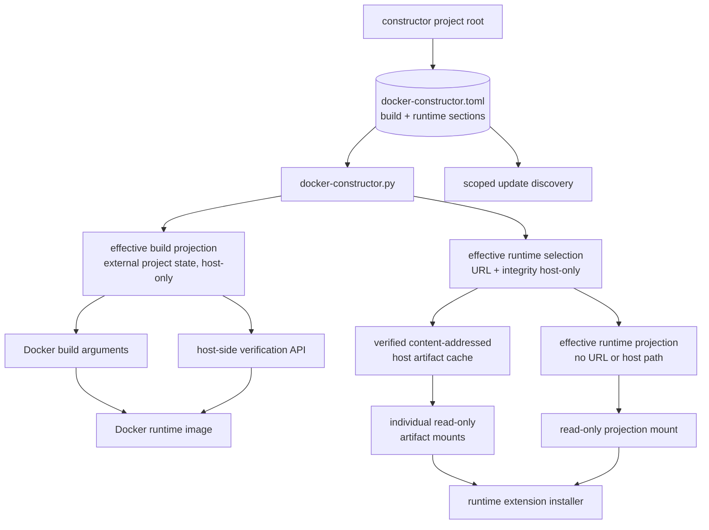
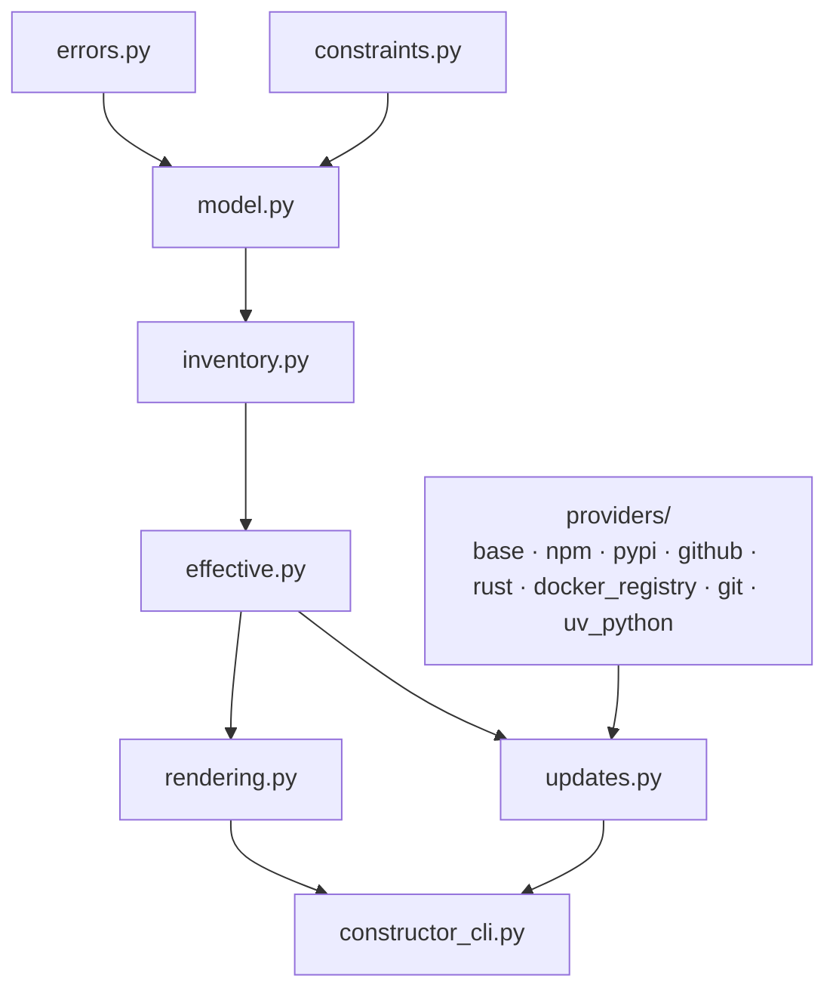

# Capability: docker-build-reproducibility

## Purpose
Define reviewed non-Debian version inventory, reproducible effective build configuration, controlled overrides, and explicit update discovery for the Docker image.

## Requirements

### Requirement: Use a central version inventory
Each selected constructor project SHALL maintain `docker-constructor.toml` directly beneath its project root as the single reviewed dependency source with explicit, closed `build` and `runtime` sections. Every independently selected dependency SHALL be represented in exactly one section by a complete typed source entry. The resolver SHALL apply phase-owned overrides and derive separate effective build and runtime projections beneath the external namespace identified by the canonical path of that constructor project. Runtime artifact URLs SHALL remain host-only materialization inputs; only the narrow effective runtime projection and individually selected read-only artifact blobs may enter a running container.

The target dependency and configuration graph SHALL remain:



#### Scenario: Validating the reviewed inventory locally
- **WHEN** `docker-constructor.py validate` runs for a selected constructor project
- **THEN** it SHALL validate build, runtime, or both source scopes as requested without Docker or network access
- **AND** it SHALL apply closed typed schemas and semantic rules appropriate to each installation phase
- **AND** it SHALL reject unknown, misspelled, duplicated-across-scope, and phase-inappropriate entries

#### Scenario: Discovering the authoritative inventory
- **WHEN** any facade command selects a constructor project from CWD or `--project-directory`
- **THEN** it SHALL use exactly `docker-constructor.toml` directly beneath that project root
- **AND** it SHALL NOT accept `--inventory`, alternate basenames, separate phase source files, parent discovery, or installation-root fallback

#### Scenario: Using an explicit custom inventory
- **WHEN** a caller attempts to select an inventory with the removed `--inventory` option
- **THEN** parsing SHALL reject the option
- **AND** SHALL require selecting the containing constructor project through CWD or `--project-directory`

#### Scenario: Describing uv-managed Python
- **WHEN** the build section declares the selected CPython runtime
- **THEN** its source and update metadata SHALL use the dedicated `uv-python` type/provider and identify the `cpython` implementation
- **AND** update discovery SHALL use the authoritative interpreter release data consumed by uv rather than modeling CPython as a PyPI package

#### Scenario: Describing a Python package tool
- **WHEN** the build section declares the selected `ty` version
- **THEN** it SHALL include a PyPI source containing package identity and a compatible PyPI update provider
- **AND** the validated in-memory build model SHALL retain the complete `ty` entry

#### Scenario: Describing runtime npm extensions
- **WHEN** the runtime section declares a selected Pi extension
- **THEN** its reviewed source entry SHALL contain package, selected default version, a reviewed artifact catalog keyed by exact version, update, override, and validation metadata required by host and runtime workflows
- **AND** every catalog entry SHALL contain the exact artifact URL and integrity for its version key
- **AND** the selected default version SHALL have a matching catalog entry
- **AND** host selection SHALL retain only the selected URL and integrity needed for materialization
- **AND** its effective runtime DTO SHALL identify only the selected mounted artifact and integrity while omitting URL, host path, unselected catalog entries, and host-only update and override metadata

#### Scenario: Building with default selections
- **WHEN** the canonical build command runs without overrides
- **THEN** it SHALL pass values derived from the selected project's build section to Docker
- **AND** it SHALL keep the reviewed source in the selected constructor project and the effective build projection beneath the external namespace identified by the selected constructor project's canonical path
- **AND** it SHALL NOT require runtime artifact materialization for image correctness

#### Scenario: Building with a supported override
- **WHEN** a supported build override such as a stable Python `X.Y.Z >= 3.14.6` is requested
- **THEN** the facade SHALL validate it against policy from the reviewed build section
- **AND** it SHALL apply it only to the host-side effective build projection
- **AND** it SHALL NOT expose that projection to the runtime container

#### Scenario: Generating effective build configuration
- **WHEN** effective Docker construction inputs are rendered with default paths
- **THEN** the build projection SHALL be written atomically beneath the selected constructor project's verified external generated-state namespace
- **AND** the runtime image SHALL NOT expose that file

#### Scenario: Preparing runtime dependency configuration
- **WHEN** a runtime container is launched with default selections or supported runtime overrides
- **THEN** default resolution SHALL select the reviewed artifact catalog entry whose exact version key matches the selected default version
- **AND** override resolution SHALL validate the requested version against reviewed policy and select only the catalog entry with that exact version key
- **AND** an override with no matching reviewed catalog entry SHALL be rejected before materialization without network discovery, URL synthesis, or reuse of another version's integrity
- **AND** the host SHALL derive a canonical content identity and deterministic cache location only from the selected validated integrity
- **AND** it SHALL materialize and verify each selected blob before Docker execution
- **AND** the resolver SHALL generate a closed effective runtime projection containing only effective package identity, version, canonical mounted-artifact identity, checksum/integrity, and validation metadata beneath the external namespace identified by the canonical selected constructor-project path
- **AND** it SHALL mount that projection read-only at `/run/pi-cli/docker-constructor.runtime.toml`
- **AND** it SHALL mount only the selected verified blobs as individual read-only files beneath `/run/pi-cli/runtime-artifacts`
- **AND** neither downloadable URLs, host cache paths, the reviewed source, nor an effective build projection SHALL be copied or mounted into the container

#### Scenario: Looking up a runtime projection for verification
- **WHEN** `verify` runs without `--runtime-projection`
- **THEN** it SHALL use the default runtime-projection lookup beneath the external namespace identified by the canonical selected constructor-project path
- **AND** when `verify --runtime-projection PATH` is supplied, it SHALL instead read exactly the caller-directed `PATH`, including when `PATH` is outside the selected constructor project
- **AND** the explicit path SHALL NOT change runtime projection creation paths, the constructor-project root, or any other project-owned path

#### Scenario: Sharing identical artifact content
- **WHEN** multiple selected runtime entries declare the same validated integrity identity
- **THEN** host materialization SHALL use one content-addressed cache blob and one container file mount
- **AND** each runtime projection entry SHALL reference that same canonical mounted identity without duplicating bytes

### Requirement: Validate overrides with a restricted constraint grammar
Overrideable entries SHALL keep an exact default `version` separate from an `override` policy. The resolver SHALL implement a dependency-free restricted grammar rather than embedding tool-specific minimum versions in code.

#### Scenario: Evaluating a valid constraint
- **WHEN** an override policy contains comma-separated `==`, `>`, `>=`, `<`, or `<=` clauses with complete numeric `X.Y.Z` operands
- **THEN** the resolver SHALL evaluate all clauses as a logical AND
- **AND** SHALL accept an override only when every clause and prerelease policy is satisfied

#### Scenario: Rejecting unsupported constraint syntax
- **WHEN** a constraint contains an unsupported operator, wildcard, OR expression, omitted version component, empty clause, or contradictory bounds
- **THEN** inventory validation SHALL fail with an actionable error

#### Scenario: Keeping the normal build exact
- **WHEN** no override is requested
- **THEN** the build SHALL select the exact `version` value
- **AND** SHALL NOT resolve the newest version matching `override.constraint`

### Requirement: Prohibit duplicated version defaults
The `build` and `runtime` sections of `docker-constructor.toml` SHALL be the only sources of their respective selected versions, revisions, artifact URLs, digests, and integrity metadata. Dockerfile, direct Docker command rendering, verification, extension setup, environment templates, and documentation SHALL NOT define independent concrete fallback values.

#### Scenario: Resolving a canonical Docker build
- **WHEN** `./docker/docker-constructor.py build` launches a build
- **THEN** it SHALL supply every required Docker build argument from the validated effective build projection
- **AND** it SHALL invoke `docker build` without concrete script-local version defaults

#### Scenario: Invoking Docker without resolved versions
- **WHEN** a repository-owned low-level Docker build path is invoked without validated resolved build values
- **THEN** it SHALL fail with an actionable instruction to use the constructor facade
- **AND** it SHALL NOT silently fall back to hard-coded versions

#### Scenario: Keeping build dependency knowledge on the host
- **WHEN** a runtime image is assembled or launched
- **THEN** neither `docker-constructor.toml` nor an effective build projection SHALL be copied into the image or mounted in the container
- **AND** build-only versions, artifact URLs, checksums, provider metadata, and override policy SHALL remain unavailable as configuration files inside the runtime container

#### Scenario: Verifying build-installed tools
- **WHEN** verification checks tools installed during image build
- **THEN** internal host-side verification APIs SHALL compare container observations with host-side effective build expectations
- **AND** they SHALL NOT provide the reviewed source or effective build projection to the container

#### Scenario: Protecting the authoritative inventory
- **WHEN** an effective-inventory output path resolves to repository-root `docker-constructor.toml`
- **THEN** rendering SHALL fail with an actionable error
- **AND** SHALL NOT overwrite the authoritative source

#### Scenario: Consuming versions at runtime
- **WHEN** runtime verification or Pi extension setup needs an expected version
- **THEN** it SHALL read the mounted effective runtime projection
- **AND** SHALL NOT use the retired runtime path or a script-local fallback

#### Scenario: Detecting stale supported references
- **WHEN** semantic-source and documentation checks inspect maintained source, active changes, scripts, and documentation
- **THEN** they SHALL reject authoritative references to `versions.toml`
- **AND** MAY exclude archived historical artifacts and filename-agnostic temporary fixtures

### Requirement: Verify installed tool versions in built image
The system SHALL verify each configured build-time tool against expectations derived from the effective build projection used to build the image. Node verification SHALL require the exact semantic version encoded in a full semantic-version Node image tag. Rust toolchain verification SHALL compare `rustc` and `cargo` to the configured Rust version. When `rustfmt` is configured as a Rust component, verification SHALL prove that rustfmt is installed and resolves through the configured rustup toolchain; it SHALL NOT require rustfmt's independently versioned banner to equal the Rust toolchain version. When `clippy` is configured, verification SHALL continue to verify its expected toolchain-derived version.

#### Scenario: All expected versions match
- **WHEN** a Docker image is built from the effective projection
- **AND** the image reports exact expected versions for Node, Rust, uv, Python, ty, rtk, fd, Pi, OpenSpec, and oh-my-zsh
- **AND** configured Rust components resolve through the configured rustup toolchain
- **THEN** the build verification reports success

#### Scenario: Exact Node image tag matches installed Node
- **WHEN** the effective build projection uses an image tag containing exact Node semantic version `24.18.0`
- **AND** `node --version` reports `v24.18.0`
- **THEN** Node verification reports success

#### Scenario: Floating Node image tag is not exact-verifiable
- **WHEN** the effective build projection uses a Node image tag without an exact semantic version
- **THEN** build verification reports that the Node expectation is not exact-verifiable
- **AND** does not silently accept a major-version-only comparison

#### Scenario: Rustfmt uses an independent component version
- **WHEN** the effective projection configures Rust `1.97.1` with the `rustfmt` component
- **AND** rustfmt resolves through the Rust `1.97.1` rustup toolchain
- **AND** rustfmt reports independent version text such as `rustfmt 1.9.0-stable`
- **THEN** rustfmt verification reports success

#### Scenario: Rustfmt is missing or resolves outside the configured toolchain
- **WHEN** the effective projection configures the `rustfmt` component
- **AND** rustfmt is absent, not installed for the configured toolchain, or resolves outside that toolchain
- **THEN** build verification reports failure identifying the rustfmt provenance mismatch

#### Scenario: Conditional Rust components
- **WHEN** `rustfmt` or `clippy` is absent from the effective projection's components list
- **THEN** build verification does not run the corresponding component check

#### Scenario: Version mismatch
- **WHEN** any configured exact version or Rust component provenance differs from the effective projection
- **THEN** the build verification reports failure with expected and observed values

### Requirement: Preserve authoritative focused pins
The central inventory SHALL incorporate the selected `rtk`/`fd` prebuilt artifacts from `split-rtk-fd-prebuilt` and Pi extension npm versions from `pin-pi-read-npm` without replacing their established installation workflows.

#### Scenario: Resolving focused dependency values
- **WHEN** effective build and runtime configuration is generated
- **THEN** it SHALL include `rtk`/`fd` versions, platform URLs, and SHA-256 digests
- **AND** SHALL include pinned Pi extension package versions

### Requirement: Keep resolver responsibilities modular
The constructor facade SHALL delegate to focused standard-library modules under `docker/versioning/`. The target module dependency flow SHALL remain:



The target production file layout SHALL be:

```text
docker/docker-constructor.py
docker/constructor_cli.py
docker/versioning/
├── errors.py
├── constraints.py
├── model.py
├── inventory.py
├── effective.py
├── rendering.py
├── updates.py
└── providers/
    ├── base.py
    ├── npm.py
    ├── pypi.py
    ├── github.py
    ├── rust.py
    ├── docker_registry.py
    ├── git.py
    └── uv_python.py
```

Responsibilities SHALL remain separated as follows:

- `errors.py`: shared configuration and CLI exception types plus dot-path diagnostics;
- `constraints.py`: numeric versions, restricted constraint parsing, matching, and contradiction detection;
- `model.py`: frozen typed inventory, source, update, artifact, and update-result values;
- `inventory.py`: TOML loading, provider-specific schema validation, cross-field validation, and deterministic traversal;
- `effective.py`: override application and deterministic effective-inventory serialization;
- `rendering.py`: Docker build/run argument vector rendering;
- `providers/`: independently testable network adapters behind a shared transport/result protocol;
- `updates.py`: provider dispatch, stable-policy filtering, applicability classification, and non-mutating suggestions;
- `constructor_cli.py`: argument parsing, output selection, exit-code mapping, and explicit process orchestration.

Dependencies between these modules SHALL remain acyclic. Domain modules SHALL NOT import the CLI facade, invoke Docker implicitly, or perform provider requests during ordinary inventory operations.

#### Scenario: Executing the stable command path
- **WHEN** a user runs `./docker/docker-constructor.py <command>`
- **THEN** the facade entry point SHALL delegate argument handling to the CLI module
- **AND** domain modules SHALL NOT parse process arguments or invoke Docker implicitly

#### Scenario: Testing provider behavior
- **WHEN** update discovery is tested
- **THEN** each provider adapter SHALL be testable independently with deterministic fake responses from an injected transport
- **AND** shared update policy and applicability behavior SHALL be tested separately from transport-specific parsing

#### Scenario: Testing domain behavior
- **WHEN** constraints, inventory validation, effective configuration, or rendering are tested
- **THEN** tests SHALL import the owning module directly
- **AND** SHALL NOT require subprocess execution, Docker, or network access

#### Scenario: Preserving import boundaries
- **WHEN** the resolver is executed directly or imported as package code
- **THEN** both paths SHALL use the same implementation modules without mutating `sys.path`
- **AND** the module dependency graph SHALL remain acyclic

### Requirement: Discover dependency updates explicitly
The version helper SHALL provide an explicit best-effort `check-updates` operation, including the dedicated `uv-python` provider for uv-managed CPython. Normal builds, launches, validation, and runtime setup SHALL NOT invoke update-provider APIs. Text-mode reporting and interactive progress SHALL conform to the `update-check-reporting` capability rather than printing a serialized Python data structure. Discovery, applicability, suggestions, structured results, and exit policy remain owned by this capability.

#### Scenario: Checking for stable updates
- **WHEN** `./docker/docker-constructor.py check-updates` runs
- **THEN** it SHALL query each configured provider for stable candidates
- **AND** SHALL report current, outdated, skipped, unavailable, or incomplete status per dependency
- **AND** its text output SHALL summarize result statuses and present every dependency according to the selected compact or detailed report defined by `update-check-reporting`
- **AND** default execution SHALL not fail solely because an update exists or a provider is unavailable

#### Scenario: Requesting detailed diagnostic output
- **WHEN** `./docker/docker-constructor.py check-updates --details` runs in text mode
- **THEN** it SHALL select the detailed text report defined by `update-check-reporting`
- **AND** the option SHALL affect presentation only and SHALL NOT change discovery, classification, suggestions, structured results, result ordering, or exit policies

#### Scenario: Reporting publication time
- **WHEN** the selected candidate has an authoritative release/version publication time from its provider
- **THEN** text presentation SHALL format it according to the selected report defined by `update-check-reporting`
- **AND** the structured JSON result SHALL retain the complete value as an additive optional field when it uses the supported UTC RFC 3339 profile `YYYY-MM-DDTHH:MM:SS[.fraction](Z|+00:00)`, where `.fraction`, when present, contains one through six decimal digits
- **AND** text presentation SHALL show `-` when the provider has no authoritative release/version publication time or supplies a malformed or unsupported timestamp; lowercase `t`/`z` forms and leap seconds are unsupported
- **AND** SHALL NOT infer publication time from response, cache, Git commit, or later supplemental artifact-upload timestamps

#### Scenario: Checking release applicability
- **WHEN** a provider reports a newer prebuilt release
- **THEN** the helper SHALL verify required architecture assets and checksum metadata are available before marking it directly applicable

#### Scenario: Distinguishing a base digest refresh
- **WHEN** the selected Docker base tag resolves to a different manifest digest
- **THEN** the helper SHALL report a digest refresh separately from a major or channel upgrade

### Requirement: Suggest reviewed updates without mutation
The version helper SHALL provide `check-updates --suggest` text output containing clearly labelled, complete, manually replaceable TOML fragments for applicable candidate updates and SHALL NOT modify repository files. Each fragment SHALL represent one schema-defined replaceable reviewed inventory block rather than one update target, SHALL include every reviewed leaf and nested table belonging to that block, and SHALL overlay every applicable candidate affecting that block before rendering. Full candidate versions, URLs, and digests SHALL remain unabridged. Text suggestions SHALL remain distinct from the existing structured JSON suggestion representation, whose fields and values SHALL remain unchanged.

#### Scenario: Printing an applicable complete replacement fragment
- **WHEN** a newer applicable release has a version, required artifact, and published digest
- **THEN** `--suggest` SHALL print the normal human-readable update report followed by a labelled complete replacement fragment for the owning reviewed inventory block
- **AND** the fragment SHALL retain unchanged source, update-policy, validation, override, and configured non-updated artifact-platform values from that block
- **AND** it SHALL state that the fragment is intended for manual replacement and is not applied automatically
- **AND** SHALL leave `docker-constructor.toml` and the working tree unchanged
- **AND** substituting the fragment for the complete corresponding block in a canonical inventory SHALL produce a configuration accepted by the ordinary inventory loader

#### Scenario: Combining updates within one replacement block
- **WHEN** two or more applicable update targets belong to the same replaceable reviewed inventory block
- **THEN** `--suggest` SHALL emit exactly one fragment for that block
- **AND** SHALL apply every applicable candidate value to that fragment
- **AND** SHALL NOT emit overlapping duplicate TOML table declarations

#### Scenario: Preserving unmodified platform artifacts
- **WHEN** an applicable candidate updates one platform artifact of a block that declares additional platforms
- **THEN** its replacement fragment SHALL include the updated candidate platform values
- **AND** SHALL retain every other configured platform artifact unchanged

#### Scenario: Displaying visual replacement boundaries
- **WHEN** `--suggest` renders a replacement fragment for canonical path `build.stages.X` or `runtime.X`
- **THEN** the fragment SHALL begin with the visual TOML comment `# --- X ---`
- **AND** every TOML table header in the fragment SHALL retain its complete canonical path
- **AND** the repository canonical inventory SHALL contain the matching visual comment immediately before the corresponding replaceable block
- **AND** missing, altered, or duplicate visual comments in another inventory SHALL NOT affect inventory parsing, validation, update discovery, target grouping, or suggestion construction

#### Scenario: Colouring a visual replacement boundary in a terminal
- **WHEN** text-mode `check-updates --suggest` is rendered to stdout and the configured colour policy permits ANSI output
- **THEN** each visual TOML comment header `# --- <display path> ---` in an emitted replacement fragment SHALL use ANSI SGR 90 (bright black)
- **AND** the replacement-block section label, TOML table headers, and TOML content SHALL remain uncoloured

#### Scenario: Preserving plain replacement fragments without terminal colour
- **WHEN** text-mode `check-updates --suggest` is rendered while the configured colour policy disables ANSI output or automatic colour detection finds stdout is not a terminal
- **THEN** each visual TOML comment header SHALL be emitted without ANSI escape sequences
- **AND** `--output json` SHALL remain ANSI-free and retain its established structured suggestion data

#### Scenario: Finding no applicable suggestion
- **WHEN** `--suggest` finds no applicable outdated release
- **THEN** it SHALL report that no reviewable replacement blocks are available
- **AND** it SHALL NOT emit an unlabeled or empty TOML fragment

#### Scenario: Encountering an incomplete release
- **WHEN** a newer release lacks a required artifact or checksum
- **THEN** the helper SHALL describe the missing data
- **AND** SHALL NOT present it as an immediately applicable update

### Requirement: Provide a directly executable version resolver
The project SHALL expose `docker/docker-constructor.py` as a directly executable user-facing command while retaining interpreter-based and package-import compatibility.

#### Scenario: Invoking the resolver directly
- **WHEN** a user runs `./docker/docker-constructor.py <command>` on a supported Unix host
- **THEN** the operating system SHALL execute the resolver through its declared Python interpreter
- **AND** arguments, stdout, stderr, and exit codes SHALL match `./docker/docker-constructor.py <command>`

#### Scenario: Inspecting the command file
- **WHEN** repository file metadata and the first line of `docker/docker-constructor.py` are inspected
- **THEN** the file SHALL have executable permission in Git
- **AND** SHALL begin with a portable Python 3 shebang

#### Scenario: Importing the resolver wrapper
- **WHEN** tests or package code import `docker.versions`
- **THEN** imports SHALL continue to delegate to the same implementation without executing the command entry point

### Requirement: Document the component update workflow concretely
Every maintained README translation SHALL explain how to inspect, review, apply, validate, and rebuild version-managed development-environment components.

#### Scenario: Updating Pi after a release
- **WHEN** a user follows the focused Pi update example
- **THEN** documentation SHALL identify `build.stages.pi-tools.pi` as the inventory path
- **AND** SHALL show a focused update check with a non-mutating suggestion
- **AND** SHALL state that the suggested version is reviewed and applied manually to `docker-constructor.toml`
- **AND** SHALL finish with inventory validation, diff review, image rebuild, and runtime verification

#### Scenario: Understanding update-check options
- **WHEN** a user reads the update reference
- **THEN** `--only` and `--suggest` SHALL be grouped as interactive review controls
- **AND** `--json`, `--strict`, and `--fail-on-outdated` SHALL be grouped as automation or policy controls
- **AND** prerelease and cache controls SHALL be described separately from the ordinary stable update path

#### Scenario: Updating a mounted Pi extension
- **WHEN** a selected update belongs to `runtime.pi-extensions`
- **THEN** documentation SHALL explain that rebuilding updates the effective image inventory
- **AND** SHALL require rerunning the protected extension installer against the mounted Pi home

### Requirement: Document version-managed component categories
Every maintained README translation SHALL identify component categories, representative members, installation ownership, and update source without duplicating concrete selected versions.

#### Scenario: Reviewing included environment components
- **WHEN** a user reviews what the development image manages
- **THEN** documentation SHALL distinguish the base image, toolchain, Node CLIs, prebuilt binaries, shell runtime, Pi extensions, and Debian packages
- **AND** SHALL distinguish image-owned paths from host-mounted Pi state
- **AND** SHALL state that Debian packages are outside `docker-constructor.toml` update discovery

### Requirement: Separate reviewed launch policy from local runtime state
The closed `runtime` section of `docker-constructor.toml` SHALL own reviewed host-access launch policy, while machine-specific host addresses SHALL reside only in the closed local TOML companion. Neither reviewed host-access policy nor local host address state SHALL enter the effective runtime dependency projection.

#### Scenario: Validating host-access policy with runtime scope
- **WHEN** the reviewed inventory contains `[runtime.host-access]`
- **THEN** runtime-scope validation SHALL validate its closed typed policy schema
- **AND** build-only validation and build projection resolution SHALL remain independent of that policy

#### Scenario: Generating the effective runtime dependency projection
- **WHEN** runtime extension selection is resolved for launch
- **THEN** the mounted effective runtime projection SHALL continue to contain only selected dependency and artifact-validation metadata
- **AND** SHALL exclude host-access mode, host address, proxy port, local companion paths, and local state

#### Scenario: Protecting reviewed source from local diagnostics
- **WHEN** `doctor` discovers or refreshes a machine-specific Docker gateway address
- **THEN** it SHALL NOT modify `docker-constructor.toml`
- **AND** ordinary inventory serialization and update discovery SHALL NOT incorporate the local companion

### Requirement: Keep cache directory paths machine-local
The reviewed `docker-constructor.toml` SHALL NOT accept `cache.dir`; a custom constructor cache root SHALL be selected only from `[cache].dir` in the resolved host-only companion. Cache-root defaults, normalization, safety validation, permissions, and child containment SHALL conform to `user-cache-storage`. Neither the local cache root nor reviewed `cache.ttl` SHALL enter an effective build or runtime dependency projection. Reviewed `cache.ttl` SHALL remain supported in `docker-constructor.toml` as portable HTTP cache policy.

#### Scenario: Migrating a reviewed cache directory
- **WHEN** validation encounters `cache.dir` in `docker-constructor.toml`
- **THEN** it SHALL reject the retired field with an instruction to move the value to the corresponding local companion
- **AND** SHALL NOT silently copy, merge, or prefer the reviewed path

#### Scenario: Resolving cache settings from separate sources
- **WHEN** reviewed `cache.ttl` and local `[cache].dir` are both configured
- **THEN** cache consumers SHALL use the reviewed TTL and the normalized validated local cache root together
- **AND** neither value SHALL enter an effective build or runtime projection

#### Scenario: Separating cache formats under a local root
- **WHEN** a local `[cache].dir` is configured
- **THEN** update-discovery HTTP cache data SHALL use its `versioning` child
- **AND** verified runtime artifacts SHALL use its `runtime-artifacts/blobs` child

#### Scenario: Rejecting the removed HTTP-only command-line cache directory
- **WHEN** a user supplies unsupported `check-updates --cache-dir`
- **THEN** command-line parsing SHALL reject the supplied option as unsupported
- **AND** SHALL NOT interpret it, select a cache path, or migrate cache data

### Requirement: Apply optional local corporate network inputs to construction
The canonical build command SHALL accept validated optional local corporate trust and proxy inputs without adding their values to the reviewed dependency inventory or effective dependency projection. When disabled, construction SHALL preserve its existing Docker argument vector and trust behavior. When enabled, the build vector SHALL provide the fixed local trust-bundle build-context convention and the required named proxy build arguments deterministically.

#### Scenario: Default construction has no corporate network inputs
- **WHEN** no corporate trust or proxy settings are configured locally
- **THEN** the rendered build vector SHALL contain no corporate proxy build arguments
- **AND** construction SHALL not require a local bundle file

#### Scenario: Enabled construction uses local-only inputs
- **WHEN** valid corporate trust and/or proxy settings are configured in the resolved local companion
- **THEN** build planning SHALL use those settings without serializing their endpoint or certificate contents into `docker-constructor.toml` or the effective dependency projection
- **AND** invalid inputs SHALL prevent Docker build execution

### Requirement: Keep cache TTL in reviewed policy
HTTP cache TTL SHALL be configured only through `[cache].ttl` in the reviewed `docker-constructor.toml`. The command SHALL NOT accept a command-local TTL override. `--no-cache` SHALL remain available as a one-invocation cache bypass and SHALL NOT modify reviewed TTL policy.

#### Scenario: Using reviewed cache TTL
- **WHEN** reviewed `[cache].ttl` is configured
- **THEN** update discovery SHALL apply that TTL to HTTP cache reads and writes
- **AND** SHALL NOT require local cache configuration

#### Scenario: Rejecting the retired TTL option
- **WHEN** a user supplies `check-updates --cache-ttl`
- **THEN** command-line parsing SHALL reject the unsupported option
- **AND** SHALL NOT override reviewed `[cache].ttl`
- **AND** SHALL perform no update discovery or cache mutation

#### Scenario: Bypassing cache for one invocation
- **WHEN** a user supplies `check-updates --no-cache`
- **THEN** update discovery SHALL bypass HTTP cache reads and writes
- **AND** SHALL NOT modify or override reviewed `[cache].ttl`

### Requirement: Construct pinned build inputs without Dockerfile artifact downloads
The canonical build SHALL resolve `linux-amd64` reviewed artifacts before Docker execution, publish its effective build projection beneath the selected external project namespace rather than the project checkout, and SHALL supply the verified local snapshot to BuildKit. Dockerfile stages for rustup, uv, rtk, and fd SHALL perform no network request for those artifacts. Existing Docker images SHALL be self-contained and SHALL not depend on retained source blobs.

#### Scenario: Building with materialized artifacts
- **WHEN** the canonical image build starts with all selected artifacts verified
- **THEN** Docker SHALL consume them from the dedicated local named context
- **AND** the corresponding stages SHALL not receive or fetch artifact URLs

#### Scenario: Running an existing image after cache cleanup
- **WHEN** source blobs used to build an existing image have been removed from the external project cache
- **THEN** that image and its containers SHALL remain operational

### Requirement: Own reviewed Node assembler toolchain expectations
The closed `[build.stages.base.node]` inventory SHALL contain required exact non-empty `node_version` and `npm_version` fields alongside the reviewed image tag and digest. These fields SHALL be the sole reviewed expected tool versions supplied to the shared assembler by Pi and later npm consumers; neither value SHALL be inferred from the image tag or lock metadata. Inventory validation SHALL reject missing, malformed, or unknown fields before materialization or Docker execution.

#### Scenario: Supplying reviewed assembler versions
- **WHEN** Pi materialization is planned
- **THEN** the exact reviewed `node_version` and `npm_version` SHALL be supplied to the assembler from `[build.stages.base.node]`
- **AND** no second expected-version source SHALL be derived

### Requirement: Install Pi from its authoritative locked release metadata
The reviewed Pi source SHALL declare npm package `@earendil-works/pi-coding-agent`, release repository `earendil-works/pi`, and release tag prefix `v`. For selected version `<version>`, the authoritative release base URL SHALL be exactly `https://github.com/earendil-works/pi/releases/download/v<version>/`, and the required asset names SHALL be exactly `pi-coding-agent-install-package.json`, `pi-coding-agent-install-package-lock.json`, and `SHA256SUMS`. The build SHALL use the two installation files only after their bytes match their respective entries in that release's `SHA256SUMS`. Before Docker build, Constructor SHALL call the side-effect-free `locked-npm-environment-assembly` input preflight with exact lock bytes, plural reviewed roots, platform, and reviewed Node/npm versions. Preflight SHALL return a digest-bound validated input with root metadata keyed by package identity/path only after requiring `[build.stages.base.node].node_version` to satisfy every reviewed-root `engines.node`; incompatibility of any root SHALL identify that root and fail with no Docker, npm, network, cache, staging, lock, publication, output path, or output evidence. Syntax-valid transitive `engines.node` metadata SHALL be accepted and discarded without enabling `engine-strict` or constraining the reviewed Node version. Constructor SHALL select exact reviewed root `@earendil-works/pi-coding-agent` and its resolved lock path and consume `bin.pi` only from that preflight result, never from another root or reparsed raw metadata. It SHALL then pass the same validated input and exact lock bytes to Docker-backed assembly, which SHALL recheck all bindings before effects, assert actual Node/npm versions, run `npm ci`, and return the validated Pi tree and output evidence. The consumer, not the assembler, SHALL construct `/opt/pi/bin/pi`; its selected target SHALL be a non-empty safe relative path whose complete filesystem resolution, including every symlink, is non-dangling and contained within the assembled Pi environment. Constructor SHALL produce consumer evidence recording the launcher’s exact contents, non-writable executable mode, resolved target, and containment within the Pi environment. A post-materialization transaction/build-plan attestation SHALL supply the expected assembled output identity, canonical output-tree digest, canonical assembler-evidence digest, and deterministic consumer-launcher-evidence digest as BuildKit inputs. The complete immutable tree, assembler evidence, and consumer launcher evidence SHALL enter the named build context; before copy, BuildKit SHALL match all four values to the attestation, recompute the output identity from the evidence-bound assembler input identity and canonical digests, and then verify both evidence sets before copy; runtime/final-layout verification SHALL verify the installed launcher and evidence again in the final image. Resolved build projection and dry-run rendering SHALL remain side-effect free and SHALL carry only the closed `prospective` attestation state rather than output-derived identities. BuildKit SHALL perform no Pi npm networking or installation, and the installed command and SDK layout under `/opt/pi` SHALL preserve the existing container interface.

#### Scenario: Deriving authoritative Pi release URLs
- **WHEN** reviewed Pi version `0.84.3`, repository `earendil-works/pi`, and tag prefix `v` are selected
- **THEN** the constructor SHALL request `https://github.com/earendil-works/pi/releases/download/v0.84.3/SHA256SUMS`
- **AND** SHALL request the two exact installation asset names beneath the same release base URL

#### Scenario: Installing a valid Pi release
- **WHEN** the selected authoritative Pi release publishes matching installation package, lockfile, and SHA256SUMS entries
- **THEN** the build SHALL verify the two files and run lockfile-frozen installation with scripts disabled
- **AND** the final image SHALL expose the selected Pi through the established command and module paths

#### Scenario: Rejecting invalid consumer launcher evidence
- **WHEN** the derived launcher’s target is unsafe or escapes the Pi environment, its contents or mode differ from consumer evidence, or its consumer evidence, assembled output identity, canonical tree digest, or canonical assembler-evidence digest differs from the expected post-materialization attestation value
- **THEN** snapshot admission or final-layout copy SHALL fail
- **AND** the launcher and Pi environment SHALL NOT enter the final image

#### Scenario: Rejecting incomplete Pi installation metadata
- **WHEN** the release repository or tag prefix is absent or invalid, any required asset is absent, either installation checksum is absent, or installation bytes do not match SHA256SUMS
- **THEN** host materialization SHALL fail before snapshot publication, npm installation, or Docker execution

#### Scenario: Preserving npm integrity checks
- **WHEN** npm fetches a dependency whose official lock entry contains integrity
- **THEN** it SHALL verify the package against that SRI
- **AND** an integrity mismatch SHALL fail the build

#### Scenario: Installing an integrity-less official Pi registry node
- **WHEN** an official Pi lock entry has an exact version and valid HTTPS registry URL but omits integrity
- **THEN** assembly SHALL accept it through pinned npm's native registry behavior
- **AND** assembler evidence SHALL identify the integrity-less node and hash the resulting published tree
- **AND** the build SHALL NOT claim that the lock byte-pins that node across cold reconstruction

### Requirement: Separate image builds from runtime workspace selection
The canonical direct Docker image-build operation SHALL resolve versioned build inputs without requiring runtime-only workspace paths, generated fragments, host bind-mount configuration, host gateway reachability, or operational gateway state.

#### Scenario: Building without runtime configuration
- **WHEN** a user runs `docker-constructor build` with no dotenv file or `WORKSPACE_PATH_*`
- **THEN** the resolver SHALL build the tagged Pi runtime image using the validated build section of the selected project's `docker-constructor.toml`
- **AND** SHALL NOT probe `host.docker.internal`, require a reachable host gateway, read or write `HOST_GATEWAY_IP`, or mutate `.env`
- **AND** SHALL NOT require a real host workspace directory merely to evaluate the build

#### Scenario: Preserving required version inputs
- **WHEN** the direct Docker build command is rendered
- **THEN** all version and artifact arguments SHALL come from the validated effective build projection
- **AND** missing version inputs SHALL NOT gain concrete Dockerfile or Python fallbacks

### Requirement: Validate reviewed inventory through the shared document boundary
The reviewed `docker-constructor.toml` SHALL be parsed and diagnosed through `configuration-document-validation` before the reviewed inventory schema is applied. The reviewed inventory owner SHALL retain responsibility for required-document handling, accepted sections and fields, value semantics, defaults, and effective projections; it SHALL NOT implement an independent TOML syntax, duplicate-definition, or parse-error projection path.

#### Scenario: Reviewed inventory TOML is malformed
- **WHEN** the selected `docker-constructor.toml` cannot be parsed
- **THEN** the shared configuration-document boundary SHALL reject it with a typed error containing the reviewed document role and path, fixed `malformed_toml` classification, and available numeric line/column coordinates
- **AND** SHALL NOT expose the raw parser message or source-document excerpt
- **AND** reviewed inventory schema validation and external effects SHALL NOT begin

#### Scenario: Reviewed inventory field is invalid
- **WHEN** TOML parsing succeeds and the reviewed schema rejects a field
- **THEN** the error SHALL identify the reviewed document path and invalid field without exposing unrelated values
